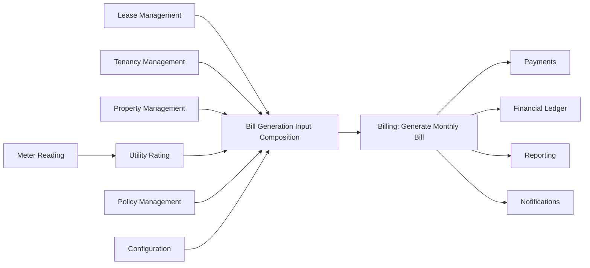

# BIL-CAP-001 — Generate Monthly Bill

## Purpose

Generate a monthly bill that records billable obligations for a tenancy period, producing a versioned and auditable billing artifact that can be finalized and consumed by downstream financial capabilities.

## Business Owner

Billing bounded context.

## Upstream Capabilities

- Lease Management
- Tenancy Management
- Property Management
- Meter Reading
- Utility Rating
- Policy Management
- Configuration Management

## Downstream Capabilities

- Payments
- Financial Ledger
- Reporting
- Notifications

## Inputs

### Canonical generation inputs currently required by Billing

- BillNumber
- TenancyReference
- LeaseReference
- PropertyReference
- PersonReference (billed party)
- BillingPeriod
- BillingCycle
- GeneratedDate
- IssueDate
- DueDate
- ChargeCollection

### Upstream business inputs needed before command assembly

- Active lease version and commercial terms for the target billing period
- Tenancy occupancy state and billed occupant context
- Utility consumption and rated utility amounts for the period (when utilities are included)
- Policy references used by lease and pricing decisions
- Bill numbering policy output

## Outputs

### Primary output

- Bill aggregate instance initialized in Generated status

### Produced business artifacts

- BillSnapshot version 1
- TotalAmount and OutstandingAmount for snapshot
- Charge, adjustment, and credit collections in snapshot state

### Produced domain event

- BillGeneratedDomainEvent

## Business Rules

Rules already represented in the repository:

- Bill number must be unique at creation time (repository uniqueness check in Billing application service).
- Bill generation requires at least one charge.
- Charge amount cannot be negative.
- Charge description length is capped.
- External charge reference length is capped.
- Due date cannot be earlier than issue date.
- Computed total (charges plus adjustments minus credits) cannot be negative.
- Snapshot version starts at 1 and increments on recalculation.
- Finalized and voided bills are immutable for adjustment and credit mutation operations.

## Configuration

Configuration currently evident around this capability:

- Lease provides rent due day, billing frequency, and grace period as commercial terms.
- Lease stores policy references, including late-fee-related references.
- Policy Framework provides generic policy typing, scoping, and applicability retrieval.

Configuration not yet directly wired in Billing generation:

- Policy-driven due date derivation
- Policy-driven late-fee computation in bill generation
- Numbering strategy resolution inside Billing boundary

## Exceptions

Expected exception scenarios based on current implementation:

- Duplicate bill number
- Missing required generation inputs
- Empty charge collection
- Negative charge amount
- Invalid due-date and issue-date relationship
- Negative computed total after charge, adjustment, and credit composition
- Mutation attempts after finalization or voiding (lifecycle protection)

## Domain Events

### Existing events

- BillGeneratedDomainEvent
- BillFinalizedDomainEvent
- AdjustmentAddedDomainEvent
- CreditAppliedDomainEvent
- BillRecalculatedDomainEvent
- BillVoidedDomainEvent

### Clearly justified future events

- BillGenerationRejectedDomainEvent (for orchestration-level validation failures before aggregate creation)
- BillGenerationInputComposedDomainEvent (to audit upstream composition completeness)

## Security

Execution access should be restricted to authorized billing actors and trusted system orchestrators.

Current state in repository:

- Billing domain and application layers do not encode role checks directly.
- Authorization is expected to be enforced by outer layers (host/security boundaries).

## Audit

The following must be auditable for each generated bill:

- Bill identifier and bill number
- Tenancy, lease, property, and billed party references
- Billing period and cycle
- Generated, issue, and due dates
- Full charge set used for generation
- Snapshot version and computed totals
- Emitted generation/recalculation/finalization/void events

Audit fields not yet explicit in billing aggregate state:

- Initiating principal identity
- Upstream input source trace
- Correlation and causation identifiers

## Reporting

Reports that depend on this capability output include:

- Monthly billed obligations by tenancy and property
- Outstanding balance and aging inputs
- Charge composition analysis (rent, utility-related, maintenance, recurring, one-time)
- Operational bill lifecycle reporting (generated, finalized, voided)

## Future Extensions

Likely expansion points:

- Policy-driven due date derivation
- Policy-driven late-fee generation
- Bill number allocation policy integration
- Meter and utility pipeline integration through explicit billing input contracts
- Richer charge providers with source provenance metadata
- Correlation/idempotency fields for end-to-end posting pipeline traceability

## Related Workstreams

- Billing (BIL)
- Payments (PAY)
- Ledger (LED)
- Charge Providers (Metering, Utility Rating, Inventory where applicable)
- Policies (Policy Framework)
- Configuration (CFG)

## Business Capability Diagram

