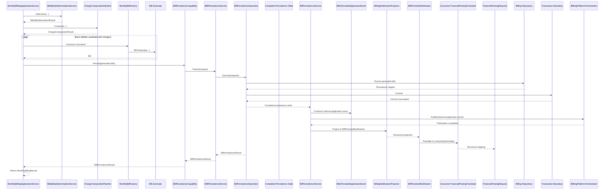

# BIL-CAP-003 - MonthlyBillingApplicationService (Foundation)

## Purpose

Provide an application-layer orchestration foundation for the monthly billing journey by coordinating existing billing capabilities in a deterministic sequence.

This capability does not introduce new billing business rules.

## Inputs

- BillingContext
- Candidate projections for billability evaluation
- Generated date
- Issue date
- Due date

## Outputs

- Generated bill references (identity, bill number, core tenancy/lease/property references, totals)
- Monthly billing summary
- Billability resolution result

## Orchestration Sequence

1. Resolve billability via BillabilityDeterminationService.
2. Compose charges via ChargeCompositionPipeline.
3. Construct bill aggregates via MonthlyBillFactory.
4. Invoke Bill.Generate() through the factory.
5. Delegate persistence phase to BillPersistenceCapability.
6. BillPersistenceCapability delegates persistence execution to IBillPersistenceService.
7. IBillPersistenceService coordinates BillPersistenceOperation execution.
8. BillPersistenceOperation completes bill persistence and returns completed persistence state to the Billing application layer.
9. BillPersistenceService constructs BillPersistenceResult for its caller.
10. BillPersistenceService constructs BillsPersistedApplicationEvent as an internal Billing application event.
11. BillingNotificationProjector constructs BillPersistedNotification for Billing's Module Public Surface.
12. Consumer-owned translators will translate BillPersistedNotification into downstream contracts.
13. Return MonthlyBillingResult.

## Interactions

- Uses billability capability as the first gate for candidate eligibility.
- Uses charge composition capability after billability completes.
- Uses billing aggregate generation only for included candidates that have composed charges.

## Journey Position

This capability is an application journey orchestrator between candidate evaluation/charge composition and bill artifact generation for monthly cycles.

## Responsibilities

- Own journey sequencing.
- Own capability orchestration and hand-offs.
- Keep orchestration order deterministic.
- Return business journey summary outcomes.
- Delegate bill aggregate construction to MonthlyBillFactory.
- Delegate persistence, commit, and publication to BillPersistenceCapability.
- BillPersistenceCapability delegates technical persistence coordination to IBillPersistenceService.
- IBillPersistenceService coordinates BillPersistenceOperation execution.
- BillPersistenceOperation performs persistence execution only.
- BillPersistenceService coordinates caller result construction and internal application-event publication.
- BillingNotificationProjector produces BillPersistedNotification for cross-module consumption.
- Consumer-owned translators convert Published Notifications into downstream contracts.

## MonthlyBillFactory Responsibility

MonthlyBillFactory is a construction helper only.

- It translates already-decided application inputs into Bill.Generate(...).
- It does not calculate charges.
- It does not determine billability.
- It does not assign bill numbers.
- It does not persist.
- It does not publish events.
- It does not call repositories.

## Bill Number Ownership

- MonthlyBillingApplicationService does not own bill number construction logic.
- Bill numbers are generated through a dedicated bill number seam.
- Current behavior is preserved intentionally.
- A Billing-owned, persistence-aware numbering policy remains deferred.

## Non-Responsibilities

- No billing rule ownership.
- No charge calculation ownership.
- No billability rule ownership.
- No persistence implementation or repository access.
- No payment or ledger behavior.
- No replacement of aggregate invariants.

## Repository Dependency

- Charge composition currently uses a temporary persistence-backed implementation for rent read facts because the repository does not yet define the published Lease/Tenancy read surface required by the documented architecture.
- This is a repository architecture dependency, not a Billing completion issue.

## Persistence Phase

- Persist only after Bill.Generate() completes.
- Executed by BillPersistenceCapability.
- Technical coordination executed by IBillPersistenceService.
- Deterministic persistence algorithm executed by BillPersistenceOperation.
- Completed persistence state returns to the Billing application layer for projection.
- Application Events are internal to Billing.
- Cross-boundary communication should use BillPersistedNotification, not Application Events.
- Financial Posting translation is structural mapping only and is not wired into persistence flow in this package.
- Uses existing Billing repository contracts.
- Persists all generated bills inside one application transaction boundary.

## Transaction Boundary

- BillPersistenceOperation owns transaction orchestration for the generated bill set.
- Commit occurs after repository persistence and before application event publication.
- On persistence failure, exception propagation is preserved and publication does not execute.

## Repository Interaction

- Executed inside BillPersistenceOperation through the existing Billing repository.
- Adds each generated Bill aggregate once.
- Does not introduce repository redesign.

## Application Event Publication

- BillPersistenceService constructs BillsPersistedApplicationEvent only after persistence succeeds.
- BillPersistenceService publishes internal application events for Billing orchestration only.
- Publication remains post-commit only.

## Financial Posting Translation Boundary

- BillingNotificationProjector converts completed persistence state into BillPersistedNotification.
- Consumer translators should translate BillPersistedNotification into downstream contracts such as FinancialPostingRequest.
- Translation remains structural mapping only, with no accounting rules, journal generation, posting execution, or persistence.

## Bill Snapshot Public Surface

- Billing publishes immutable snapshot business facts through `BillSnapshotModel`.
- `BillSnapshotModel` is Billing-owned language and must not include accounting semantics.
- `BillPersistedNotification` remains a lightweight happened signal only.

### Currency Invariant

- Every persisted bill snapshot must carry exactly one `CurrencyCode`.
- Mixed-currency charge composition for one bill is rejected before bill generation.
- Multi-currency bill support is out of scope and requires an explicit future architecture decision.

### Billing To Accounting Contract Flow

Billing Events

-> Billing Translator

-> FinancialPostingRequest

-> Accounting

- Billing never creates journal entries.
- Billing never writes ledger records.
- Accounting owns financial posting.

## Next Capability

### BIL-CAP-003B - Financial Ledger Integration

Responsibilities:

- Integrate persisted billing outputs with Financial Ledger posting.
- Preserve monthly billing persistence boundaries established by BIL-CAP-003A.

Explicit boundary:

- Ledger integration is not part of BIL-CAP-003A.
