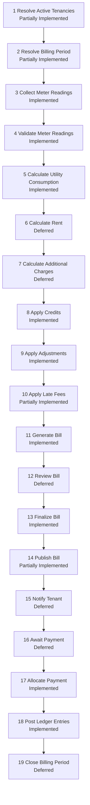

# BIL-JRN-001 - Monthly Billing Journey

## Scope

Canonical business journey for monthly billing in Masterdom, based on current repository implementation only.

Status legend:

- Implemented
- Partially Implemented
- Deferred
- Future capability

## Journey Diagram

## Capability Mapping

| Step | Journey Step                  | Primary Capability/Module Mapping                                  | Current Support       |
| ---- | ----------------------------- | ------------------------------------------------------------------ | --------------------- |
| 1    | Resolve Active Tenancies      | Tenancy + Lease foundations, consumed by Billing references        | Partially Implemented |
| 2    | Resolve Billing Period        | Billing period value object + bill generation inputs               | Partially Implemented |
| 3    | Collect Meter Readings        | Metering reading submission workflow                               | Implemented           |
| 4    | Validate Meter Readings       | Metering approval and correction workflow                          | Implemented           |
| 5    | Calculate Utility Consumption | Metering consumption + Utility Rating rating workflow              | Implemented           |
| 6    | Calculate Rent                | Intentionally deferred billing-run capability for rent composition | Deferred              |
| 7    | Calculate Additional Charges  | Intentionally deferred billing-run capability for extra charges    | Deferred              |
| 8    | Apply Credits                 | Billing credit mutation                                            | Implemented           |
| 9    | Apply Adjustments             | Billing adjustment mutation                                        | Implemented           |
| 10   | Apply Late Fees               | Policy/lease references exist; no dedicated late-fee operation     | Partially Implemented |
| 11   | Generate Bill                 | Billing aggregate generation command/service                       | Implemented           |
| 12   | Review Bill                   | Intentionally deferred billing control-point capability            | Deferred              |
| 13   | Finalize Bill                 | Billing finalization command/service                               | Implemented           |
| 14   | Publish Bill                  | Domain events published; no explicit bill publication operation    | Partially Implemented |
| 15   | Notify Tenant                 | Intentionally deferred billing handoff capability                  | Deferred              |
| 16   | Await Payment                 | Intentionally deferred billing lifecycle capability                | Deferred              |
| 17   | Allocate Payment              | Payment allocation command/service with bill settlements           | Implemented           |
| 18   | Post Ledger Entries           | Financial Ledger post billing/payment journal commands             | Implemented           |
| 19   | Close Billing Period          | Intentionally deferred billing-period closeout capability          | Deferred              |

## Implementation Matrix

| #   | Step                          | Purpose                                             | Business Owner            | Inputs                                                                                  | Outputs                                              | Upstream Dependencies                        | Downstream Dependencies                 | Existing Repository Support                                                                                         | Status                |
| --- | ----------------------------- | --------------------------------------------------- | ------------------------- | --------------------------------------------------------------------------------------- | ---------------------------------------------------- | -------------------------------------------- | --------------------------------------- | ------------------------------------------------------------------------------------------------------------------- | --------------------- |
| 1   | Resolve Active Tenancies      | Identify billable active occupancies for cycle      | Tenancy, Lease, Billing   | Unit/property occupancy, tenancy status, lease status                                   | Candidate tenancy-lease set for billing              | Tenancy aggregate lifecycle, lease lifecycle | Billing input composition               | Active tenancy and lease concepts exist, but no monthly billing resolver/query pipeline found                       | Partially Implemented |
| 2   | Resolve Billing Period        | Determine billing window for run                    | Billing                   | Run date, cycle configuration                                                           | Billing period per bill run                          | Calendar/configuration policy                | Charge and bill generation steps        | Billing period value object exists and is required input, but period resolution/orchestration is not implemented    | Partially Implemented |
| 3   | Collect Meter Readings        | Capture utility measurements                        | Metering                  | Meter id, reading value/date/source                                                     | Persisted meter reading (pending/approved lifecycle) | Metering module                              | Validation and utility rating           | Meter reading submission is implemented in metering service and aggregate                                           | Implemented           |
| 4   | Validate Meter Readings       | Ensure reading correctness and approval             | Metering                  | Submitted readings, reviewer data                                                       | Approved or corrected readings                       | Metering submission                          | Consumption calculation                 | Approval/correction invariants implemented (monotonicity, period constraints, etc.)                                 | Implemented           |
| 5   | Calculate Utility Consumption | Convert validated readings to rated utility amounts | Metering, Utility Rating  | Approved reading consumption, tariff schedule                                           | Rated consumption amount                             | Metering approved readings                   | Bill charge composition                 | Consumption and rating operations implemented in metering and utility rating modules                                | Implemented           |
| 6   | Calculate Rent                | Produce rent charge amount for period               | Billing + Lease           | Lease terms, billing period                                                             | Rent charge line(s)                                  | Lease commercial terms                       | Bill generation                         | Deferred in the current repository journey; Billing charge composition is backed by a temporary persistence adapter | Deferred              |
| 7   | Calculate Additional Charges  | Produce non-rent billable charges                   | Billing + source domains  | Charge provider outputs, policy inputs                                                  | Additional charge line(s)                            | Upstream service domains, policies           | Bill generation                         | Deferred in the current repository journey; additional-source workflow is not a separate Billing control point      | Deferred              |
| 8   | Apply Credits                 | Apply credit offsets to outstanding bill            | Billing                   | Credit line + bill id + effective dates                                                 | New bill snapshot with credit                        | Existing generated bill                      | Finalized totals/outstanding balance    | Credit mutation command and aggregate behavior implemented                                                          | Implemented           |
| 9   | Apply Adjustments             | Apply bill adjustments after generation             | Billing                   | Adjustment line + bill id + effective dates                                             | New bill snapshot with adjustment                    | Existing generated bill                      | Finalized totals/outstanding balance    | Adjustment mutation command and aggregate behavior implemented                                                      | Implemented           |
| 10  | Apply Late Fees               | Add overdue penalties where policy applies          | Billing + Policy          | Due-date status, late-fee policy                                                        | Penalty line(s)/adjustment(s)                        | Policy references and lease terms            | Bill publication/final amount           | Policy references exist and adjustment path exists, but no explicit late-fee workflow/command                       | Partially Implemented |
| 11  | Generate Bill                 | Create auditable bill artifact                      | Billing                   | Bill number, tenancy/lease/property/person references, period/cycle, due dates, charges | Bill aggregate with snapshot v1 and generated status | Upstream charge composition                  | Review/finalization/publication         | Bill generation command/service and aggregate generation are implemented                                            | Implemented           |
| 12  | Review Bill                   | Human/system review before finalization             | Billing operations        | Generated bill and controls                                                             | Approved/rejected review decision                    | Bill generation                              | Finalization                            | Deferred business control point in the current repository journey                                                   | Deferred              |
| 13  | Finalize Bill                 | Lock bill for downstream release                    | Billing                   | Bill id                                                                                 | Finalized bill state                                 | Generated/reviewed bill                      | Publication, payment, reporting         | Finalization command and aggregate transition are implemented                                                       | Implemented           |
| 14  | Publish Bill                  | Expose finalized bill to downstream channels        | Billing + Platform events | Finalized bill/domain events                                                            | Published events/messages                            | Finalized bill                               | Notification, payment intake, reporting | Domain event publishing is implemented, but no explicit publication step artifact/status for bills                  | Partially Implemented |
| 15  | Notify Tenant                 | Notify billed party of issued/finalized bill        | Notifications + Billing   | Bill publication payload                                                                | Tenant notification delivery                         | Bill publication                             | Payment journey                         | Deferred downstream handoff in the current repository journey                                                       | Deferred              |
| 16  | Await Payment                 | Track waiting state until payment received          | Billing + Payment         | Published bill with due terms                                                           | Awaiting/overdue operational state                   | Bill publication                             | Payment allocation, collections         | Deferred downstream lifecycle state in the current repository journey                                               | Deferred              |
| 17  | Allocate Payment              | Apply received payment to bill obligations          | Payment                   | Payment receipt plus bill settlement contracts                                          | Payment allocations and status updates               | Payment receipt/collection                   | Ledger posting and balance updates      | Payment allocation command and domain logic are implemented                                                         | Implemented           |
| 18  | Post Ledger Entries           | Record financial postings from billing/payment      | Financial Ledger          | Posting contracts and ledger id                                                         | Journal transactions and posting batch updates       | Billing/payment events or orchestrations     | Financial reporting/reconciliation      | Post billing/payment journal commands and ledger service are implemented                                            | Implemented           |
| 19  | Close Billing Period          | Formally close period to further changes            | Billing operations        | End-of-cycle controls and reconciled artifacts                                          | Closed period marker/state                           | Ledger and billing completion                | Next billing cycle start                | Deferred period closeout in the current repository journey                                                          | Deferred              |

## Dependency Matrix

| Step                            | Upstream Dependencies                                      | Downstream Dependencies                                            |
| ------------------------------- | ---------------------------------------------------------- | ------------------------------------------------------------------ |
| 1 Resolve Active Tenancies      | Tenancy statuses, lease statuses, occupancy lifecycle      | 2 Resolve Billing Period, 11 Generate Bill                         |
| 2 Resolve Billing Period        | Calendar/cycle policy, configuration                       | 6 Calculate Rent, 7 Calculate Additional Charges, 11 Generate Bill |
| 3 Collect Meter Readings        | Meter installation and active meter registry               | 4 Validate Meter Readings                                          |
| 4 Validate Meter Readings       | Submitted meter readings, review controls                  | 5 Calculate Utility Consumption                                    |
| 5 Calculate Utility Consumption | Approved readings, tariff schedule                         | 7 Calculate Additional Charges, 11 Generate Bill                   |
| 6 Calculate Rent                | Lease commercial terms, active tenancy set, billing period | 11 Generate Bill                                                   |
| 7 Calculate Additional Charges  | Utility rating, policy outputs, additional source charges  | 11 Generate Bill                                                   |
| 8 Apply Credits                 | Existing bill, approved credits                            | 11/13 bill state and outstanding balance                           |
| 9 Apply Adjustments             | Existing bill, approved adjustment reason                  | 11/13 bill state and outstanding balance                           |
| 10 Apply Late Fees              | Due-date state, late-fee policy references                 | 11/13 totals and publication                                       |
| 11 Generate Bill                | Steps 1, 2, 6, 7 and optional 8, 9, 10                     | 12 Review Bill, 13 Finalize Bill                                   |
| 12 Review Bill                  | Generated bill, internal control process                   | 13 Finalize Bill                                                   |
| 13 Finalize Bill                | Generated/reviewed bill                                    | 14 Publish Bill                                                    |
| 14 Publish Bill                 | Finalized bill and domain events                           | 15 Notify Tenant, 16 Await Payment, 18 Post Ledger Entries         |
| 15 Notify Tenant                | Published bill payload                                     | 16 Await Payment                                                   |
| 16 Await Payment                | Published bill and due terms                               | 17 Allocate Payment, 10 Apply Late Fees                            |
| 17 Allocate Payment             | Received payment and bill settlement mapping               | 18 Post Ledger Entries                                             |
| 18 Post Ledger Entries          | Posting contracts from billing/payment                     | 19 Close Billing Period, reporting                                 |
| 19 Close Billing Period         | Reconciled billing and ledger posting outcomes             | Next monthly cycle readiness                                       |

## Deferred Journey Notes

- Steps 6, 7, 12, 15, 16, and 19 are intentionally deferred in the current repository journey.
- These are journey-capability deferrals, not Billing correctness defects.
- The implemented Billing core still covers bill generation, finalization, credit and adjustment mutation, and bill queries.
