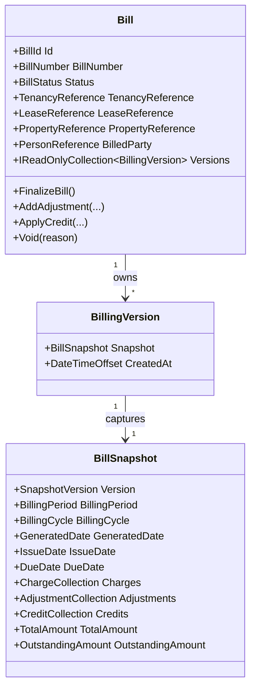

# Billing Domain Foundation

- Document ID: ARCH-DOMAIN-005
- Title: Billing Domain Foundation
- Version: 1.0
- Status: Active
- Owner: Domain Engineering
- Last Updated: 2026-07-27
- Next Review: [TBD]
- Related ADRs: [docs/adr/ADR-0004_Domain_Boundaries.md](../adr/ADR-0004_Domain_Boundaries.md)
- Related Standards: [docs/standards/ENG-001_Engineering_Standards.md](../standards/ENG-001_Engineering_Standards.md)
- Related Playbooks: [docs/playbooks/MODULE_DEVELOPMENT_GUIDE.md](../playbooks/MODULE_DEVELOPMENT_GUIDE.md)

## Purpose

Establish the Billing bounded-context foundation as the obligation and adjustment model that produces immutable bill snapshots.

## Scope

This document covers:

- Bill aggregate boundary and lifecycle
- Charge, adjustment, and credit modeling
- Snapshot versioning and recalculation invariants
- Application-layer orchestration and repository boundary
- Platform abstraction consumption through billing orchestrator

This document does not define payment settlement, receipts, collections workflows, meter ingestion, taxation engines, or financial-ledger posting.

## Aggregate Model

## Financial Model

Billing obligations are represented as immutable value objects:

- ChargeLine and ChargeCollection
- AdjustmentLine and AdjustmentCollection
- CreditLine and CreditCollection
- BillSnapshot and BillingVersion

The model captures:

- charge composition and category
- bill-level currency code
- signed adjustments
- applied credits
- generated total and outstanding amount
- historical version snapshots for recalculation traceability

## Domain Invariants

- A bill requires at least one charge line.
- Billing period start date must be before end date.
- Due date cannot be earlier than issue date.
- Bill total and outstanding amount cannot be negative.
- Finalized bills are immutable.
- Voided bills are immutable.
- Finalized bills cannot be voided.
- Every adjustment or credit operation creates a new snapshot version.
- Every persisted bill snapshot contains exactly one bill-level currency code.
- Mixed-currency charge composition for a single bill is rejected.

## Domain Events

Bill aggregate emits:

- BillGeneratedDomainEvent
- BillFinalizedDomainEvent
- BillRecalculatedDomainEvent
- AdjustmentAddedDomainEvent
- CreditAppliedDomainEvent
- BillVoidedDomainEvent

## Cross-Context Boundary

Billing references external contexts only through identifiers:

- TenancyReference
- LeaseReference
- PropertyReference
- PersonReference

Billing does not import Tenancy, Lease, Property, or Person aggregate models.

## Persistence Boundary

Infrastructure adapts billing through EF Core mappings:

- `bills` aggregate table
- `bill_versions` owned version table
- JSONB snapshots for billing state
- Domain events ignored for persistence

## Platform Integration

Billing operations consume platform abstractions through orchestrator:

- Configuration
- Metadata
- Rules
- Workflow
- Domain event publishing
