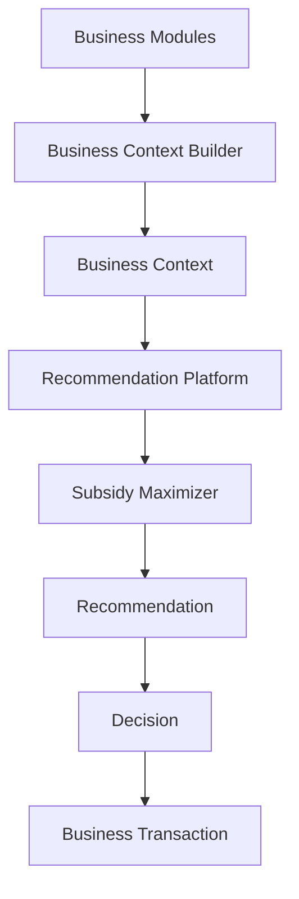

# Business Context Platform

- Document ID: ARCH-PLATFORM-CONTEXT-001
- Title: Business Context Platform
- Version: 1.0
- Status: Active
- Owner: Platform and Domain Engineering
- Last Updated: 2026-08-03
- Next Review: [TBD]
- Related ADRs: [docs/adr/ADR-0001_Modular_Architecture.md](../adr/ADR-0001_Modular_Architecture.md), [docs/adr/ADR-0002_Configuration_First.md](../adr/ADR-0002_Configuration_First.md), [docs/adr/ADR-0004_Domain_Boundaries.md](../adr/ADR-0004_Domain_Boundaries.md), [docs/adr/ADR-0005_Versioned_Configuration.md](../adr/ADR-0005_Versioned_Configuration.md)
- Related Standards: [docs/standards/ENG-001_Engineering_Standards.md](../standards/ENG-001_Engineering_Standards.md), [docs/standards/BUSINESS_CONFIGURATION_ASSET_STANDARD.md](../standards/BUSINESS_CONFIGURATION_ASSET_STANDARD.md)
- Related Playbooks: [docs/playbooks/PLATFORM_DEVELOPMENT_GUIDE.md](../playbooks/PLATFORM_DEVELOPMENT_GUIDE.md)

## Purpose

Define Business Context as a reusable platform asset that assembles read-only business state snapshots for intelligent capabilities.

Business Context is not business data ownership and not business rule ownership.

## Scope

This platform architecture includes:

- Business Context Builder
- Business Context snapshot model
- Context ownership boundaries
- Dependency direction for recommendation and subsidy capabilities
- Interaction with Business Configuration Assets

This platform architecture excludes:

- business rule execution
- business transaction execution
- module write-side behavior
- automatic business state mutation

## Business Context Platform

Business Context Platform is a reusable platform asset consumed by intelligent modules.

Business modules must not rebuild equivalent context independently.

Business Context is read-only assembled state used for analysis, optimization, recommendation, and intelligence.

## Business Context Builder

Business Context Builder assembles context data from module-owned sources and platform-owned contracts.

Builder responsibilities:

- collect references and snapshots from producer modules
- apply effective-date and version selection through platform abstractions
- create immutable Business Context snapshots
- preserve reproducibility and auditability metadata

Builder does not:

- execute business rules
- change business module state
- perform write-side orchestration

## Business Context Ownership Model

Business Context owns references to:

- Property Context
- Unit Context
- Tenancy Context
- Occupancy Context
- Meter Context
- Billing Context
- Payment Context
- Reporting Context
- Financial Ledger Context
- Configuration Context
- Language Context
- Effective Date Context
- Security Context
- User Context
- Portfolio Context

### Property Context

Contains read-only property state:

- property records
- property hierarchy
- relationships
- groups
- metadata
- effective configuration references

### Unit Context

Contains read-only unit state:

- units
- hierarchy
- capacity
- occupancy
- relationships

### Tenancy Context

Contains read-only tenancy state:

- current tenancy
- historical tenancy
- move-ins
- move-outs
- status

### Meter Context

Contains read-only meter state:

- meters
- readings
- corrections
- consumption
- failures
- estimated readings

### Billing Context

Contains read-only billing state:

- bills
- charges
- outstanding balances
- penalty state
- utility charges

### Payment Context

Contains read-only payment state:

- payments
- allocations
- reversals
- credits

### Configuration Context

Contains references or immutable snapshots aligned with repository architecture for:

- Formula Catalog
- Rate Catalog
- Tariff Catalog
- Penalty Catalog
- Policy Catalog
- Provider Catalog
- Optimization Model Catalog
- Optimization Strategy Catalog
- Language Resource Catalog
- Import Definitions
- Notification Templates
- Report Definitions
- Document Templates

## Characteristics

Business Context is:

- read-only
- versioned
- auditable
- immutable after creation
- reproducible
- explainable
- composable
- provider-independent

Business Context is never edited.

## Interaction with Recommendation Platform

Recommendation Platform consumes Business Context snapshots as analysis input.

Recommendation Platform does not reconstruct business context independently.

Recommendation and Decision architecture remains independent of module write-side logic.

## Interaction with Subsidy Maximizer

Subsidy Maximizer consumes:

- Business Context Platform
- Recommendation Platform contracts
- Business Configuration Assets

Subsidy Maximizer produces recommendations only and does not modify business data automatically.

## Dependency Direction

Business modules consume approved decisions through normal module boundaries.

## Updated Implementation Roadmap

1. Phase 1: Business Context Platform implementation
2. Phase 2: Recommendation Platform contracts (Recommendation, Recommendation Bundle, Decision, Optimization Session)
3. Phase 3: Subsidy Maximizer v1 using Business Context Platform and Recommendation Platform
4. Phase 4: Calculation Engine discovery across reusable formulas, tariffs, rates, penalties, optimization models
5. Phase 5: Generic Calculation Engine implementation
6. Phase 6: Subsidy Maximizer refactor to consume Calculation Engine with no behavior change

## Architecture Freeze

Business Context Platform architecture is frozen as part of MASTERDOM BASELINE v1.

Further refinement is only allowed when implementation reveals a genuine architectural defect.
