# Calculation Engine Composites

## Purpose

This document defines the frozen Level 2 Composite Calculations for the Calculation Engine.

Level 2 composites are pure consumers of frozen Level 1 primitives.

They do not own business workflows, orchestration, repository interaction, or configuration lookup behavior.

## Composite Catalog

| Capability ID                   | Composite Name                        | Primitive Dependencies                                                                                              | Purity     | Determinism   | Stability    | Compatibility | Composition Level | Contract Version |
| ------------------------------- | ------------------------------------- | ------------------------------------------------------------------------------------------------------------------- | ---------- | ------------- | ------------ | ------------- | ----------------- | ---------------- |
| estimation.consumption          | Consumption Estimation Composite      | aggregation.mean, aggregation.weighted_mean, normalization.ratio, interpolation.weighted_blend, normalization.clamp | Contextual | Deterministic | Stable       | Supported     | Composite         | 1.0.0            |
| forecast.projection             | Forecast Projection Composite         | normalization.ratio, projection.trend_factor, projection.threshold_variance                                         | Contextual | Deterministic | Stable       | Supported     | Composite         | 1.0.0            |
| scoring.confidence_composite    | Confidence Composite                  | statistics.spread, normalization.clamp, scoring.confidence                                                          | Contextual | Deterministic | Stable       | Supported     | Composite         | 1.0.0            |
| scoring.scenario                | Scenario Score Composite              | scoring.weighted_score, normalization.clamp                                                                         | Contextual | Deterministic | Stable       | Supported     | Composite         | 1.0.0            |
| ranking.scenario                | Scenario Ranking Composite            | ranking.order, ranking.tie_break, ranking.top_n                                                                     | Contextual | Deterministic | Stable       | Supported     | Composite         | 1.0.0            |
| transformation.import_canonical | Canonical Import Conversion Composite | transformation.canonical_date, transformation.canonical_number, transformation.canonical_boolean, validation.range  | Contextual | Deterministic | Experimental | Supported     | Composite         | 1.0.0            |
| validation.pagination           | Pagination Composite                  | normalization.bounds_guard, normalization.ratio                                                                     | Contextual | Deterministic | Fundamental  | Obsolete      | Composite         | 1.0.0            |

## Frozen Descriptor Table

| Descriptor ID | Capability ID                   | Composition Level | Descriptor Version | Contract Version | Stability    | Compatibility |
| ------------- | ------------------------------- | ----------------- | ------------------ | ---------------- | ------------ | ------------- |
| ce-op-00024   | estimation.consumption          | Composite         | 1.0                | 1.0.0            | Stable       | Supported     |
| ce-op-00025   | forecast.projection             | Composite         | 1.0                | 1.0.0            | Stable       | Supported     |
| ce-op-00026   | scoring.confidence_composite    | Composite         | 1.0                | 1.0.0            | Stable       | Supported     |
| ce-op-00027   | scoring.scenario                | Composite         | 1.0                | 1.0.0            | Stable       | Supported     |
| ce-op-00028   | ranking.scenario                | Composite         | 1.0                | 1.0.0            | Stable       | Supported     |
| ce-op-00029   | transformation.import_canonical | Composite         | 1.0                | 1.0.0            | Experimental | Supported     |
| ce-op-00030   | validation.pagination           | Composite         | 1.0                | 1.0.0            | Fundamental  | Obsolete      |

## Composite Outputs

- Consumption Estimation Composite
  - EstimatedBaseline
  - FailedMeterEstimate
  - OccupancyAdjustedEstimate
  - DataCompletenessRatio
- Forecast Projection Composite
  - TrendFactor
  - ProjectedConsumption
  - ThresholdVariance
- Confidence Composite
  - ConfidenceScore
- Scenario Score Composite
  - CompositeScenarioScore
- Scenario Ranking Composite
  - RankedScenarioCollection
- Canonical Import Conversion Composite
  - CanonicalImportValues
- Pagination Composite
  - SafePaginationMetadata

## Metadata Fields

Composite metadata descriptors are persisted through the shared Calculation Operation metadata model and include:

- Capability ID
- Composite Name
- Primitive Dependencies
- Purity
- Determinism
- Stability
- Compatibility
- Composition Level
- Contract Version

## Primitive Dependency Graph

```mermaid
graph TD
    C1[estimation.consumption] --> P1[aggregation.mean]
    C1 --> P2[aggregation.weighted_mean]
    C1 --> P3[normalization.ratio]
    C1 --> P4[interpolation.weighted_blend]
    C1 --> P5[normalization.clamp]

    C2[forecast.projection] --> P3
    C2 --> P6[projection.trend_factor]
    C2 --> P7[projection.threshold_variance]

    C3[scoring.confidence_composite] --> P8[statistics.spread]
    C3 --> P5
    C3 --> P9[scoring.confidence]

    C4[scoring.scenario] --> P10[scoring.weighted_score]
    C4 --> P5

    C5[ranking.scenario] --> P11[ranking.order]
    C5 --> P12[ranking.tie_break]
    C5 --> P13[ranking.top_n]

    C6[transformation.import_canonical] --> P14[transformation.canonical_date]
    C6 --> P15[transformation.canonical_number]
    C6 --> P16[transformation.canonical_boolean]
    C6 --> P17[validation.range]

    C7[validation.pagination] --> P18[normalization.bounds_guard]
    C7 --> P3
```

## Dependency Direction

Dependency direction is frozen and one-way:

- Level 2 Composite -> Level 1 Primitive
- Level 1 Primitive -X-> Level 2 Composite

No business module references are allowed from Level 2 composites.

## Governance

- Composite capability IDs are immutable once frozen.
- Composite dependencies may only reference primitive capability IDs.
- Composite metadata and implementation must stay synchronized.
- Composite calculators must remain stateless and side-effect free.
- Composite registry is metadata-only and must not execute calculations.

## Capability ID Governance

- Existing Level 2 capability IDs are immutable.
- Existing descriptor IDs are immutable.
- Existing primitive dependency lists are immutable.
- Existing descriptor version and contract version are immutable.
- Existing compatibility and stability metadata are immutable.

## Registry Responsibilities

- Discover composite descriptors from the metadata registry.
- Resolve composites by capability id and descriptor id.
- Resolve composite descriptor subsets by family, compatibility, and stability.
- Validate composite dependency graph integrity during registry construction.
- Resolve dependencies by immutable capability id, not descriptor discovery order.
- Generate a deterministic topological graph view for validation and diagnostics.
- Remain metadata-only and never execute calculations.

## Validation Rules

- Every primitive dependency must exist in the descriptor set.
- Duplicate primitive dependencies are forbidden.
- Dependency validation is capability-based and independent from reflection or file ordering.
- Deterministic ordering is produced from dependency graph topology, not declaration position.
- Composite-to-composite dependency is forbidden unless explicitly allowed.
- Composite dependency cycles are forbidden.
- Composite dependencies must belong to Level 1 primitives.

## Allowed Future Changes

- Add new Level 2 descriptors with new capability IDs.
- Deprecate existing Level 2 descriptors.

## Forbidden Future Changes

- Modify existing capability IDs.
- Modify existing descriptor IDs.
- Modify existing dependency lists for frozen descriptors.
- Change composition level of existing Level 2 descriptors.
- Change descriptor version or contract version of existing frozen descriptors.
- Change compatibility or stability metadata semantics of existing frozen descriptors.

## Versioning

- Composite descriptor schema version: 1.0
- Composite contract version: 1.0.0
- Existing frozen descriptors remain immutable across minor stabilization packages.
- Additive composite expansion is permitted only through new capability IDs.
- Existing capability IDs and semantic contracts remain backward compatible unless superseded by approved architecture governance.

## Deprecation Policy

- Deprecated descriptors remain discoverable in metadata.
- Deprecated descriptors keep their original descriptor ID and capability ID.
- Deprecated descriptors keep original dependency chain and contract shape.
- Deprecation must be metadata-only and must not alter execution pipeline ownership.
- Removal of deprecated descriptors requires explicit architecture approval and replacement path.

## Freeze Policy

MASTERDOM BASELINE v1 applies.

- Level 1 primitive contracts, metadata, identifiers, registries, implementations, execution pipeline, and discovery remain frozen.
- Level 2 composite implementation is a pure consumption layer over frozen Level 1 primitives.
- Any structural redesign of execution, metadata contracts, or dependency direction requires explicit architecture approval before changes.

## Freeze Declaration

- Freeze Date: 2026-08-04
- Freeze Version: 1.0.0
- Architecture Baseline: MASTERDOM BASELINE v1
- Repository Validation Status: Passed
- Validation Commands:
  - `dotnet build Masterdom.slnx`
  - `dotnet test tests/Masterdom.Platform.Tests`
  - `dotnet test tests/Masterdom.Core.Tests`
  - `dotnet test tests/Masterdom.Architecture.Tests`
- Validation Result:
  - Solution build passed.
  - Masterdom.Platform.Tests passed.
  - Masterdom.Core.Tests passed.
  - Masterdom.Architecture.Tests passed.

## Freeze Governance

Future changes to frozen Level 2 composite metadata require all of the following:

- Architecture rationale.
- Impact analysis.
- Backward compatibility review.
- Migration strategy when the change affects frozen identifiers, metadata, or consumer expectations.
- Repository-wide validation using the full build and test commands recorded in this document.

Implementation convenience alone is never sufficient justification for changing frozen Level 2 composite metadata.
