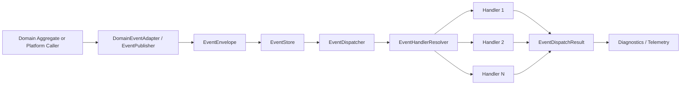

# Event Infrastructure

- Document ID: ARCH-PLATFORM-007
- Title: Platform Event Infrastructure
- Version: 1.0
- Status: Active
- Owner: Platform Engineering
- Last Updated: 2026-07-27
- Next Review: [TBD]
- Related ADRs: [docs/adr/ADR-0003_Module_Registration.md](../adr/ADR-0003_Module_Registration.md), [docs/adr/ADR-0004_Modular_Monolith_And_Bounded_Contexts.md](../adr/ADR-0004_Modular_Monolith_And_Bounded_Contexts.md)
- Related Standards: [docs/standards/ENG-001_Engineering_Standards.md](../standards/ENG-001_Engineering_Standards.md)
- Related Playbooks: [docs/playbooks/PLATFORM_DEVELOPMENT_GUIDE.md](../playbooks/PLATFORM_DEVELOPMENT_GUIDE.md)

## Purpose

Define the platform event infrastructure introduced by PDP-007.

The framework captures, publishes, stores, and dispatches platform events in-process.

The framework does not implement external messaging systems, notification channels, or third-party integration transports.

## Scope

This document covers:

- Event model and envelope metadata
- Event hierarchy and contracts
- Registry/resolver/dispatcher/publisher pipeline
- Domain-event adaptation into platform events
- Runtime and kernel integration boundaries
- In-memory persistence abstractions
- Phase-2 extension boundaries for outbox and messaging

## Event Architecture

The platform exposes typed contracts for event lifecycle orchestration:

- Event identity and typing: `EventId`, `EventType`, `EventVersion`
- Event body and context: `EventPayload`, `EventContext`
- Immutable envelope: `EventEnvelope`
- Event contracts: `IEvent`, `IPlatformEvent`, `IApplicationEvent`, `IIntegrationEvent`, `INotificationEvent`, `IDomainRuntimeEvent`
- Runtime services: `IEventRegistry`, `IEventHandlerResolver`, `IEventDispatcher`, `IEventPublisher`, `IEventStore`, `IEventRepository`

The pipeline is intentionally in-process and deterministic.

These platform event contracts are runtime infrastructure abstractions.

They are not the canonical Published API of a bounded context.

Handlers are resolved and invoked according to dispatch policy with failure isolation and per-handler execution diagnostics.

## Pipeline Diagram

## Event Lifecycle

1. An event is raised from platform runtime or adapted from domain events.
2. Event metadata is normalized into `EventEnvelope`.
3. Envelope is saved through `IEventStore` (repository abstraction behind it).
4. Dispatcher resolves subscribed handlers from registry and resolver.
5. Handlers execute according to dispatch policy.
6. Execution result is returned with per-handler outcome and diagnostics.

## Handler Lifecycle

1. Handler descriptors are registered in event registry.
2. Registry validation enforces:
   - Duplicate event descriptors
   - Duplicate handler registrations
   - Missing required handlers
   - Invalid subscriptions
   - Circular dispatch dependencies
3. Dispatcher resolves handlers for event type.
4. Idempotency tracker can short-circuit already-processed handlers.
5. Handler errors are isolated and recorded without terminating all dispatch work.

## Runtime Integration

Kernel integration includes:

- `IPlatformContext.Events`
- `IPlatformContext.DomainEvents`
- Lifecycle event publication during kernel/module startup and shutdown phases
- Catalog event registration during module catalog loading

Domain aggregates remain source-of-truth for domain events.

`DomainEventAdapter` and `DomainEventPublisher` translate domain events into platform runtime envelopes without changing aggregate root ownership.

## Persistence Boundaries

PDP-007 provides event persistence abstractions and in-memory implementations:

- `IEventRepository`
- `IEventStore`
- `InMemoryEventRepository`
- `EventStore`

No transport, broker, outbox relay, or inbox processor is implemented in this phase.

## Future Outbox Extension

The extension boundary is defined through:

- `IEventOutbox`
- `IEventIdempotencyTracker`

Phase-2 work should add durable outbox persistence, relay scheduling, retry governance, and operational observability without breaking the event model contracts.

## Future Messaging Extension

Messaging is deliberately outside PDP-007 scope.

Future messaging framework work should:

- Map Published APIs or approved boundary contracts into transport-specific messages
- Add publisher and consumer infrastructure adapters
- Add delivery guarantees and poison-message handling
- Maintain bounded-context ownership and anti-corruption boundaries

## Current Limitations

- Event pipeline persistence is in-memory by default.
- Durable delivery guarantees are not part of this package.
- Cross-process distribution is not part of this package.
- Governance workflows for event contract versioning are future work.

## Next Package

- PKG-Event-Infrastructure-Phase2 should activate durable event persistence and outbox relay integration.
- PKG-Messaging-Framework should introduce external transport and integration event delivery infrastructure.
