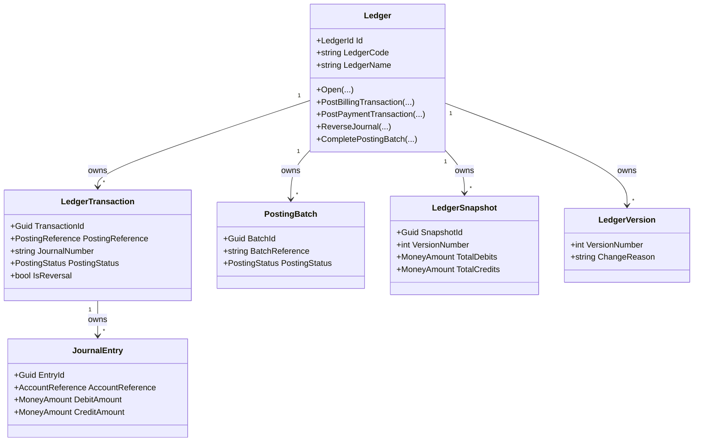
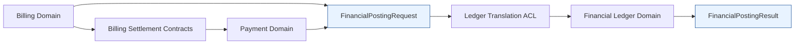

# Financial Ledger Foundation

- Document ID: ARCH-DOMAIN-011
- Title: Financial Ledger Foundation
- Version: 1.0
- Status: Active
- Owner: Domain Engineering
- Last Updated: 2026-08-01
- Next Review: [TBD]
- Related ADRs: [docs/adr/ADR-0002_Configuration_First.md](../adr/ADR-0002_Configuration_First.md), [docs/adr/ADR-0004_Domain_Boundaries.md](../adr/ADR-0004_Domain_Boundaries.md), [docs/adr/ADR-0005_Versioned_Configuration.md](../adr/ADR-0005_Versioned_Configuration.md), [docs/adr/ADR-0006_Financial_Ledger_Foundation_Freeze.md](../adr/ADR-0006_Financial_Ledger_Foundation_Freeze.md)
- Related Standards: [docs/standards/ENG-001_Engineering_Standards.md](../standards/ENG-001_Engineering_Standards.md)
- Related Playbooks: [docs/playbooks/MODULE_DEVELOPMENT_GUIDE.md](../playbooks/MODULE_DEVELOPMENT_GUIDE.md)

## Purpose

Establish the Financial Ledger bounded context as the owner of immutable accounting history for operational financial events.

This foundation records posted financial events but does not own bills, payments, bank reconciliation, or reporting.

## Read-Only Findings

Billing owns obligations, adjustments, and credits, but explicitly excludes ledger posting.

Payment core is complete for Stage 2 and owns receipt, allocation, and reversal history, while ledger posting and accounting journals remain intentionally outside the Payment foundation.

Automatic Billing to Financial Ledger and Payment to Financial Ledger activation is intentionally deferred and belongs to future Platform Integration work rather than Financial Ledger implementation scope.

This deferred activation is not missing Financial Ledger implementation and is not a Billing or Payment deficiency.

Policy Framework provides reusable policy versioning and scope governance, but not accounting behavior.

Configuration, Rules, and Workflow frameworks already provide deterministic configuration, rule selection, and orchestration hooks that Ledger can consume without importing upstream domain internals.

Architecture documentation and repository memory confirm that a dedicated ledger bounded context did not previously exist in the repository.

## Ownership Boundaries

Financial Ledger owns:

- Ledger
- LedgerId
- LedgerEntry
- LedgerTransaction
- LedgerAccount
- LedgerPosting
- Journal
- JournalEntry
- PostingBatch
- PostingReference
- LedgerSnapshot
- LedgerVersion

Financial Ledger does not own:

- Bills
- Payments
- Metering
- Utility Rating
- Subsidy Optimization
- Reporting
- Bank reconciliation

## Aggregate Diagram

## Ledger Lifecycle

1. Open a ledger and establish immutable version 1 plus initial snapshot.
2. Record balanced transactions from published Billing or Payment contracts.
3. Append immutable versions and snapshots for each posting mutation.
4. Reverse journals by creating reversing transactions instead of overwriting history.
5. Complete posting batches for operational closure while preserving transaction history.

## Posting Lifecycle

1. Operational domain emits contract-shaped posting input.
2. Ledger validates journal balance and creates a posted transaction.
3. Journal entries are stored immutably under that transaction.
4. Posting batch tracks operational grouping and later completion.
5. Any correction is represented by a reversing journal entry set, never by mutation or deletion.

## Versioning Model

- Ledger versions are append-only and monotonic.
- Historical entries are immutable.
- Corrections create reversing entries.
- Journal numbers remain immutable after posting.
- Snapshots preserve cumulative debit and credit state across versions.

## Domain Events

- LedgerTransactionCreatedDomainEvent
- JournalPostedDomainEvent
- JournalReversedDomainEvent
- LedgerSnapshotCreatedDomainEvent
- PostingBatchCompletedDomainEvent
- LedgerVersionCreatedDomainEvent

## Contract Boundaries

Financial Ledger consumes Billing and Payment only through local published contracts:

- BillingLedgerPostingContract
- PaymentLedgerPostingContract

For Billing posting semantics preparation, Financial Ledger now consumes Billing public business snapshots through:

- BillSnapshotModel

The module does not import Billing or Payment aggregate types.

## Billing Snapshot Posting Preparation

Financial Ledger owns consumer-side translation and posting preparation for Billing snapshots:

- BillingSnapshotTranslator: maps BillSnapshotModel to an internal posting source model.
- BillingSnapshotPostingValidator: validates required identifiers, references, monetary values, and currency consistency.
- PostingLineGenerator: derives balanced debit/credit posting lines and account selection.
- BillingFinancialPostingRequestFactory: maps generated lines into FinancialPostingRequest.
- LegacyPostingAdapter: maps generated lines to BillingLedgerPostingContract for compatibility with the existing command path.
- Posting mechanics are now treated as internal implementation details inside Financial Ledger.
- Posting-rule resolution is exposed through the `IPostingRuleProvider` boundary rather than configuration objects.
- Implementation selection for the posting pipeline occurs in `src/Masterdom.Infrastructure/DependencyInjection.cs`; application services consume abstractions only.
- The in-memory chart-of-accounts and rule catalog remain the current default implementation behind the provider boundary.

Boundary rules:

- Translation is deterministic and stateless.
- Posting-line generation and validation remain inside Financial Ledger.
- No Billing domain internals are consumed.
- No journal persistence, messaging, outbox, or transport concerns are introduced in this capability slice.

Prepared journal ownership:

- PreparedJournal remains Financial Ledger application workflow state.
- Its invariants are workflow invariants: non-empty identities, balanced lines, one journal currency, and valid UTC lifecycle transitions.
- Those invariants remain in the posting workflow because they govern orchestration, idempotency, and post-validation transitions rather than core ledger domain behavior.
- The object stays internal to the module boundary and is not promoted into the domain aggregate model during this hardening pass.

Current provider boundary:

- IPostingRuleProvider is the canonical boundary for posting-rule lookup and catalog access.
- IChartOfAccounts remains an internal implementation detail behind BillingPostingRuleEngine and InMemoryChartOfAccounts.
- BillingPostingRuleEngine is the current provider implementation.
- The default in-memory provider remains available for current deployments and tests.

## Financial Ledger Foundation Freeze

Package 3E establishes the frozen Financial Ledger foundation.

Frozen boundaries:

- The Financial Ledger posting seam is IPostingRuleProvider.
- PreparedJournal remains internal Financial Ledger workflow state.
- Ledger remains the aggregate owner of immutable accounting history.
- Implementation selection for the posting pipeline stays in `src/Masterdom.Infrastructure/DependencyInjection.cs`.
- Application services must continue to depend on abstractions only.

Freeze rules:

- No new Financial Ledger architectural seams are introduced without a superseding ADR.
- No application service may instantiate posting implementations directly.
- Any future change to the frozen boundary requires a new package review and a new ADR.

## Composition Root Responsibilities

The infrastructure composition root owns implementation selection for the posting pipeline:

- registers the in-memory chart-of-accounts data source
- registers the current chart-of-accounts provider implementation
- registers journal-number generation and posting orchestration services
- keeps application services free of implementation instantiation and configuration-object boundaries

## Accounting Rule Inventory (Billing)

Current Financial Ledger policy catalog defines these accounting mappings:

| Business Event   | Source Business Fact                            | Debit Account            | Credit Account                  | Current Posting Policy                                 | Balancing Behavior                                |
| ---------------- | ----------------------------------------------- | ------------------------ | ------------------------------- | ------------------------------------------------------ | ------------------------------------------------- |
| Monthly Rent     | BillSnapshot charge category RENT               | 1100 Accounts Receivable | 4100 Rental Revenue             | Debit receivable, credit rental revenue by line amount | One debit total line equals sum of charge credits |
| Late Fee         | BillSnapshot charge category LATEFEE            | 1100 Accounts Receivable | 4700 Late Fee Revenue           | Debit receivable, credit late fee revenue              | One debit total line equals sum of charge credits |
| Security Deposit | BillSnapshot charge category SECURITYDEPOSIT    | 1100 Accounts Receivable | 2200 Security Deposit Liability | Debit receivable, credit liability                     | One debit total line equals sum of charge credits |
| Discount         | BillSnapshot charge category DISCOUNT           | 1100 Accounts Receivable | 4710 Discount Contra Revenue    | Debit receivable total, credit contra-revenue line     | One debit total line equals sum of charge credits |
| Adjustment       | BillSnapshot adjustment-related categories      | 1100 Accounts Receivable | 4800 Adjustment Revenue         | Debit receivable, credit adjustment account            | One debit total line equals sum of charge credits |
| Reversal         | Reversal operation over generated posting lines | Original credit accounts | Original debit accounts         | Reverse original line directions and amounts           | Reversal totals match original totals             |

Repository evidence for source facts:

- Billing charge categories are source-owned in Billing charge snapshots.
- Financial Ledger owns account selection and posting semantics.

## Structural Validation vs Business Policy

Structural validation (BillingSnapshotPostingValidator) owns:

- required identifiers and references
- chronology and billing period validity
- currency shape and single-currency consistency
- positive values
- charge completeness and total reconciliation

Business policy (BillingPostingPolicy) owns:

- account selection
- event-to-account mapping
- accounting rule catalog

PostingLineGenerator applies business policy after structural validation succeeds.

## Current Posting Assumptions

Current generator assumptions are explicit:

- receivable debit is generated as one total line per bill snapshot
- charge lines generate per-category credit lines
- account code selection is policy-driven by charge category
- posting line currency is bill snapshot currency
- balancing is required and enforced before journal preparation

## Journal Preparation and Lifecycle Persistence

JournalPreparationService prepares a balanced PreparedJournal structure using explicit identity references:

- accepts generated posting lines
- verifies balanced totals and one-journal currency
- assigns journal reference and batch reference
- assigns deterministic posting reference and business journal number
- carries business references and metadata

PreparedJournal lifecycle states are explicit and append-only in intent:

- Prepared
- Validated
- Posted
- Reversed
- Cancelled

Lifecycle timestamps are captured per transition and enforced as UTC.

PreparedJournal is intentionally modeled as application workflow state rather than a domain aggregate because:

- the lifecycle exists to coordinate posting execution and persistence replay
- the invariant checks are specific to posting readiness, not ledger ownership
- the ledger aggregate remains the owner of immutable accounting history after posting

## Persistence Flow (Package 3D)

Prepared journal lifecycle records are durably persisted before and after posting:

1. Prepare journal from Billing snapshot translation and posting line generation.
2. Persist prepared lifecycle record in prepared_journals.
3. Transition lifecycle to Validated.
4. Post transaction through Ledger aggregate.
5. Transition lifecycle to Posted with posted transaction id.

Idempotency and uniqueness protections:

- ledger_transactions has unique posting_reference and journal_number indexes.
- prepared_journals has unique (ledger_id, posting_reference).
- prepared_journals has unique (ledger_id, journal_number).
- Duplicate posting references with equal semantic content are replay-safe.
- Duplicate posting references with divergent content are rejected as conflicts.

## Persistent Chart Of Accounts Path

The current chart of accounts is still in-memory, but the next architectural step is a persistent, versioned provider model.

Target shape:

- repository-backed chart-of-accounts records owned by Financial Ledger
- effective-dated and versioned account definitions
- audit fields for source, authoring context, and publication state
- tenant/property scoping where the business model requires it
- migration path that can seed the persistent provider from the current default catalog without changing posting behavior

Migration intent:

- preserve existing account codes and posting outcomes
- introduce persistence as an implementation detail behind the provider boundary
- avoid changing posting semantics until the persistent catalog is proven and reviewed

Remaining technical debt:

- the chart-of-accounts provider is still backed by the in-memory catalog
- the compatibility policy facade remains in place until consumer code is fully aligned to the provider boundary
- persistent, versioned chart-of-accounts storage is still deferred

## Journal Identity Strategy (Package 3E)

Financial Ledger separates identity concerns:

PostingReference:

- deterministic idempotency key
- replay detection key
- conflict detection key for duplicate requests with divergent content

JournalNumber:

- business-visible journal identity
- human-readable reference with configurable formatting
- immutable after creation
- unique by ledger transaction constraints

CorrelationId:

- cross-service trace token from source systems
- diagnostic and observability metadata
- not used as idempotency key

Business journal numbers are generated from business-oriented tokens using:

- configurable format tokens: prefix, source, date, sequence
- non-hash sequence token suitable for audit readability
- existing uniqueness constraints for concurrency safety

PostingReference remains the deterministic replay key.

## Chart of Accounts Foundation (Package 3E)

Chart of Accounts is now represented as a first-class accounting source for posting resolution:

- account identity: account code and account name
- account hierarchy: optional parent account code
- account classification: asset, liability, equity, revenue, expense, contra-revenue, other
- effective dates: effective-from and optional effective-to
- active/inactive state: posting is allowed only for active, effective accounts

Financial Ledger owns this accounting model and resolves posting accounts against active chart entries.

Bootstrap defaults remain available but are now centralized in chart and rule options rather than embedded in posting policy code paths.

## Posting Rule Engine (Package 3E)

Posting behavior is now resolved through an explicit rule engine:

Charge Category
-> Posting Rule
-> Chart of Accounts
-> Posting Account Selection

Responsibilities:

- interpret Billing-owned charge categories
- resolve posting rule definitions
- resolve active chart-of-accounts entries
- produce PostingAccountSelection consumed by posting line generation

Billing continues to own only Billing business facts.

Financial Ledger continues to own accounting policy and account resolution.

## Legacy Adapter Assessment

LegacyPostingAdapter remains the compatibility bridge to BillingLedgerPostingContract.

Current role:

- map generated posting lines into existing legacy command contract shape
- preserve functional parity for existing PostBillingJournal invocation paths

Cutover criteria:

1. PreparedJournal persistence path is the primary write path in production.
2. Business journal numbering and deterministic posting-reference idempotency are enabled in all target environments.
3. Integration and regression tests confirm parity for totals, references, and lifecycle transitions.
4. No active production callers remain on legacy contract-only posting paths.
5. Rollback plan and deprecation window are approved.

## Chart of Accounts Migration Path (Design Only)

Chart-of-accounts evolution remains a configuration-governed migration concern, not a runtime redesign:

1. Introduce versioned account mapping definitions in configuration scope.
2. Keep historical journal lines immutable against original account codes.
3. Apply new mapping versions only to new postings from effective date forward.
4. Provide controlled translator fallback for unknown or deprecated categories.
5. Require reconciliation checkpoints before activating new mapping versions.

## Ledger Aggregate Boundary Assessment (Read-Only)

Current Ledger boundary remains cohesive for the implemented capability scope because it still owns a single accounting consistency boundary:

- posting invariants
- idempotency and conflict detection
- journal uniqueness
- posting batch progression
- immutable transaction history and snapshots

Prepared-journal lifecycle persistence remains an application/persistence concern and does not currently fracture aggregate consistency guarantees.

Recommendation:

- keep Ledger as the current aggregate root for Package 3E
- re-evaluate Journal-as-aggregate only when lifecycle transitions require independent transactional consistency, independent command throughput scaling, or materially different retention/locking patterns

Estimated migration cost if split later:

- medium to high (transaction boundary redesign, repository split, migration strategy, command orchestration updates)

## Persistence Boundary

- ledgers
- ledger_accounts
- ledger_transactions
- journal_entries
- posting_batches
- ledger_snapshots
- ledger_versions
- prepared_journals

## Technical Debt

- Billing and Payment do not yet publish shared ledger-hand-off contracts, so the initial contract boundary is local to the Ledger module.
- Opening-balance orchestration and chart-of-accounts governance are intentionally deferred and should be introduced later without collapsing domain boundaries.

## Recommendation Before PDP-023

Define shared operational posting contracts and explicit hand-off Published APIs before introducing reporting, reconciliation, or accounting exports.

## FIN-I-001 Canonical Financial Integration Architecture

### Decision Summary

Masterdom adopts a single authoritative financial integration boundary based on shared Financial Posting Contracts in Masterdom.Abstractions.

Settlement contracts are owned by Billing as source-domain outbound contracts.

Posting contracts are owned by the shared boundary and consumed by Financial Ledger through translation, not through source-specific posting contracts.

### Boundary Ownership

Settlement contract ownership:

- Billing owns bill settlement projection contracts.
- Payment consumes Billing settlement contracts through an anti-corruption adapter.
- Payment does not own Billing settlement contract shape.

Posting contract ownership:

- Shared boundary owns FinancialPostingRequest and FinancialPostingResult.
- Billing publishes Billing-owned Published APIs that consumers translate into FinancialPostingRequest.
- Payment publishes Payment-owned Published APIs that consumers translate into FinancialPostingRequest.
- Financial Ledger consumes FinancialPostingRequest through a Ledger translator and returns FinancialPostingResult.

### Translation Responsibilities

Billing translation:

- Billing aggregate or application projection -> Billing Published API.

Payment translation:

- Billing settlement contract -> Payment allocation input model.
- Payment aggregate or application projection -> Payment Published API.

Ledger translation:

- Billing Published API -> FinancialPostingRequest.
- Payment Published API -> FinancialPostingRequest.
- FinancialPostingRequest -> Ledger posting input model.
- Ledger posting outcome -> FinancialPostingResult.

### Anti-Corruption Layers

- Billing ACL: shields Billing domain from Payment and Ledger types.
- Payment ACL: shields Payment domain from Billing internals and ledger posting internals.
- Ledger ACL: shields Ledger domain from Billing and Payment internals and source-specific contract drift.
- Shared Posting ACL: enforces a stable, versioned contract model for all financial publishers.

### Migration Order

Phase 1

- Keep existing contracts active.
- Introduce Billing-owned settlement contract as the authoritative settlement boundary.
- Keep Payment consumption backward compatible through adapter mapping.

Phase 2

- Introduce publisher-owned Published API projectors in Billing and Payment.
- Introduce consumer-side translators from Published APIs into FinancialPostingRequest.
- Introduce Ledger translator from FinancialPostingRequest to ledger posting model.

Phase 3

- Route posting operations through Financial Posting Contracts as the primary path.
- Keep legacy ledger posting contracts as compatibility path.

Phase 4

- Freeze legacy contract shapes.
- Remove write-path usage of BillingLedgerPostingContract and PaymentLedgerPostingContract.

Phase 5

- Retire legacy contracts after compatibility window closes and all callers are migrated.

### Legacy Contract Retirement Plan

- BillSettlementContract: move ownership to Billing contract surface and keep compatibility aliases during migration.
- BillingLedgerPostingContract: mark deprecated when shared posting pipeline is active.
- PaymentLedgerPostingContract: mark deprecated when shared posting pipeline is active.
- Legacy removal gate: no active consumers, compatibility window complete, and release gate approval.

### Backward Compatibility Strategy

- Use adapter-based dual-read and dual-write transition at integration boundaries.
- Preserve versioned contract fields and default handling for optional metadata.
- Keep FinancialPostingRequest.ContractVersion and FinancialPostingResult.ContractVersion as compatibility switch points.
- Keep old contract endpoints callable until migration completion criteria are met.

### Final Dependency Graph

### Cross-Module Dependency Target State

- Billing -> Shared Financial Posting Contracts
- Payment -> Billing Published APIs and Shared Financial Posting Contracts where approved
- Financial Ledger -> Billing and Payment Published APIs plus Shared Financial Posting Contracts where approved
- No module consumes another module aggregate types directly.
