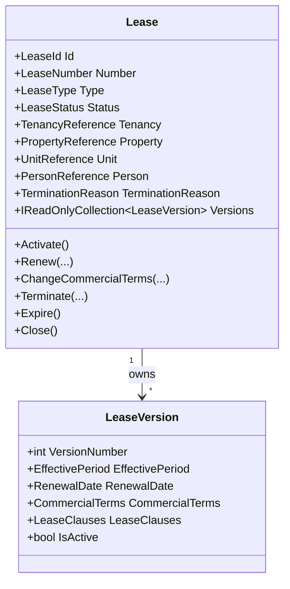

# Lease Domain Foundation

- Document ID: ARCH-DOMAIN-004
- Title: Lease Domain Foundation
- Version: 1.0
- Status: Active
- Owner: Domain Engineering
- Last Updated: 2026-07-27
- Next Review: [TBD]
- Related ADRs: [docs/adr/ADR-0004_Domain_Boundaries.md](../adr/ADR-0004_Domain_Boundaries.md)
- Related Standards: [docs/standards/ENG-001_Engineering_Standards.md](../standards/ENG-001_Engineering_Standards.md)
- Related Playbooks: [docs/playbooks/MODULE_DEVELOPMENT_GUIDE.md](../playbooks/MODULE_DEVELOPMENT_GUIDE.md)

## Purpose

Establish the Lease bounded-context foundation as the contractual model governing a tenancy.

## Scope

This document covers:

- Lease aggregate boundary and lifecycle
- Versioned commercial terms and lease clauses
- Effective-period and renewal invariants
- Configuration-aware policy references
- Application-layer orchestration and repository boundary
- Platform abstraction consumption through lease orchestrator

This document does not define billing, invoices, payments, meter readings, collections, notifications, or reporting workflows.

## Aggregate Model

## Commercial Model

Commercial terms are represented as immutable value objects:

- RentTerms
- DepositTerms
- RenewalTerms
- TerminationTerms

The model captures:

- Monthly rent
- Billing frequency
- Grace period
- Rent due day
- Deposit amount and rules reference
- Renewal policy reference
- Notice period
- Late-fee policy reference

These terms are configuration-aware through explicit policy-reference fields and do not execute billing calculations.

## Domain Invariants

- Effective date must be before expiry date.
- Only one active lease version is allowed.
- Renewal must create a new lease version.
- Commercial-term changes must create a new lease version.
- Closed leases are immutable.

## Domain Events

Lease aggregate emits:

- LeaseCreatedDomainEvent
- LeaseActivatedDomainEvent
- LeaseRenewedDomainEvent
- LeaseTerminatedDomainEvent
- LeaseExpiredDomainEvent
- CommercialTermsChangedDomainEvent

## Cross-Context Boundary

Lease references external contexts only through identifiers:

- TenancyReference
- PropertyReference
- UnitReference
- PersonReference

Lease does not import Tenancy, Property, or Person aggregate models.

## Persistence Boundary

Infrastructure adapts lease through EF Core mappings:

- `leases` aggregate table
- `lease_versions` owned version table
- JSONB snapshots for commercial terms, effective period, and clauses
- Domain events ignored for persistence

## Platform Integration

Lease operations consume platform abstractions through orchestrator:

- Configuration
- Metadata
- Rules
- Workflow
- Domain event publishing
