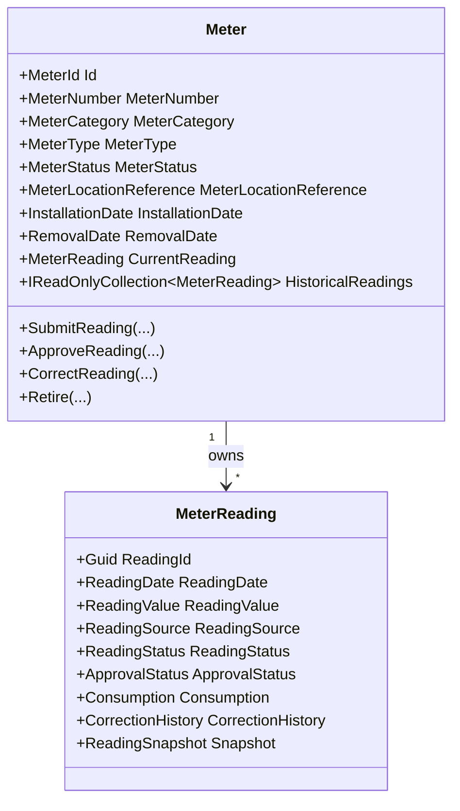

# Metering Domain Foundation

- Document ID: ARCH-DOMAIN-006
- Title: Metering Domain Foundation
- Version: 1.0
- Status: Active
- Owner: Domain Engineering
- Last Updated: 2026-08-04
- Next Review: [TBD]
- Related ADRs: [docs/adr/ADR-0004_Domain_Boundaries.md](../adr/ADR-0004_Domain_Boundaries.md)
- Related Standards: [docs/standards/ENG-001_Engineering_Standards.md](../standards/ENG-001_Engineering_Standards.md)
- Related Playbooks: [docs/playbooks/MODULE_DEVELOPMENT_GUIDE.md](../playbooks/MODULE_DEVELOPMENT_GUIDE.md)

## Purpose

Establish the Metering bounded-context foundation as the ownership boundary for meter assets and lifecycle-managed meter readings.

## Scope

This document covers:

- Meter aggregate boundary and lifecycle
- Reading submission, approval, correction, and retirement lifecycle
- Implemented command/query surface and API exposure
- Consumption calculation invariants
- Application-layer orchestration and repository boundary
- Platform abstraction consumption through metering orchestrator

This document does not define tariff engines, subsidy calculations, invoice generation, settlement, ledger posting, analytics, or reporting workflows.

## Aggregate Model

## Implemented Surface

Metering currently exposes the following business operations through complete vertical slices:

- Commands: Install, SubmitReading, ApproveReading, CorrectReading, Retire
- Queries: GetMeterById, GetMeterByNumber
- API endpoints: POST /api/meters/, PUT /api/meters/{meterId}/readings, PUT /api/meters/{meterId}/readings/{readingId}/approve, PUT /api/meters/{meterId}/readings/{readingId}/correct, PUT /api/meters/{meterId}/retire, GET /api/meters/{meterId}, GET /api/meters/by-number/{meterNumber}

Infrastructure supporting that surface includes:

- Meter repository and EF Core persistence mappings
- Unit of Work boundary for command execution
- Platform orchestrator integration for configuration, metadata, rules, workflow, and domain event publishing
- Dependency injection and authorization wiring for the Metering command/query surface

Test coverage currently includes:

- Domain tests for Meter aggregate behavior
- Handler tests for command execution
- Runtime composition tests for DI and handler registration
- Integration tests for endpoint and runtime wiring

## Reading Lifecycle

1. Meter is installed and activated.
2. Reading is submitted with source, value, submitter, and optional notes.
3. Reading is approved by reviewer and consumption is calculated.
4. Approved reading may be corrected with explicit reason and history preservation.
5. Meter is retired and further mutations are blocked.

## Domain Rules

- Reading values cannot be negative.
- Consumption cannot be negative.
- Readings are monotonic unless rollover is explicitly declared.
- Only one approved reading is allowed per period.
- Corrections preserve immutable history via correction records.
- Future readings are controlled via configuration at orchestration boundary.
- Retired meters cannot accept new readings or corrections.

## Domain Events

Meter aggregate emits:

- MeterInstalledDomainEvent
- ReadingSubmittedDomainEvent
- ReadingApprovedDomainEvent
- ReadingCorrectedDomainEvent
- ConsumptionCalculatedDomainEvent
- MeterRetiredDomainEvent

## Cross-Context Boundary

Metering references external contexts only through identifiers:

- Property identifier
- Unit identifier

Metering does not import Billing, Lease, Tenancy, People, or Property aggregates.

## Persistence Boundary

Infrastructure adapts metering through EF Core mappings:

- meters aggregate table
- meter_readings owned reading table
- JSONB persistence for correction history and reading snapshot
- Domain events ignored for persistence

## Platform Integration

Metering operations consume platform abstractions through orchestrator:

- Configuration
- Metadata
- Rules
- Workflow
- Domain event publishing

## Domain Event Lifecycle

ClearDomainEvents exists solely to satisfy the aggregate domain-event lifecycle required by the platform publisher.

- It is invoked by platform infrastructure after domain events are published.
- It is intentionally not a business capability.
- It must not be exposed through commands, handlers, services, or APIs.
