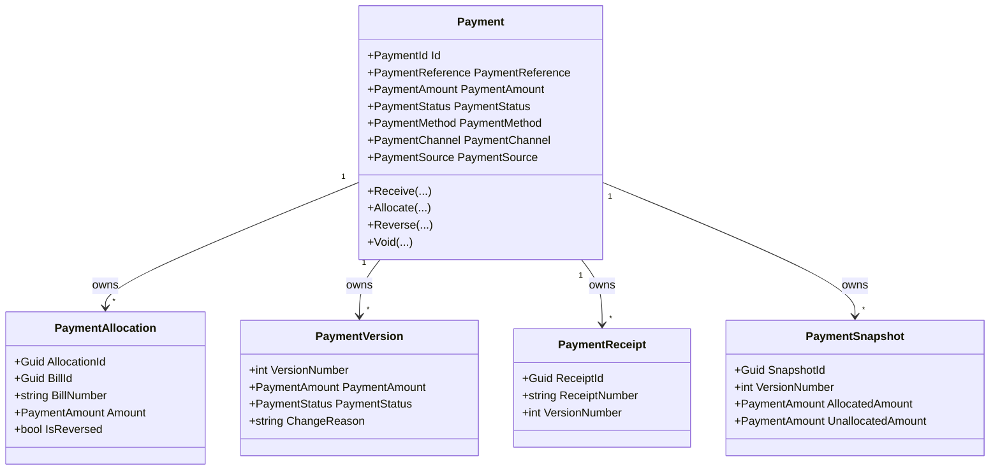

# Payment Domain Foundation

- Document ID: ARCH-DOMAIN-010
- Title: Payment Domain Foundation
- Version: 1.0
- Status: Active
- Owner: Domain Engineering
- Last Updated: 2026-07-27
- Next Review: [TBD]
- Related ADRs: [docs/adr/ADR-0002_Configuration_First.md](../adr/ADR-0002_Configuration_First.md), [docs/adr/ADR-0005_Versioned_Configuration.md](../adr/ADR-0005_Versioned_Configuration.md)
- Related Standards: [docs/standards/ENG-001_Engineering_Standards.md](../standards/ENG-001_Engineering_Standards.md)
- Related Playbooks: [docs/playbooks/MODULE_DEVELOPMENT_GUIDE.md](../playbooks/MODULE_DEVELOPMENT_GUIDE.md)

## Purpose

Establish the Payment bounded context as the owner of payment lifecycle, settlement allocation, reversal history, receipt generation, and immutable payment versions.

This foundation is the Stage 2 completion baseline for Payment.

This foundation intentionally excludes ledger posting, accounting, refunds, gateways, reconciliation, and reporting.

## Read-Only Findings

Billing owns immutable bill versions and outstanding balance state but explicitly excludes payment settlement.

Repository evidence confirms the Payment core is implemented across domain, application, infrastructure, host, and tests.

Policy Framework now provides reusable policy scope and versioning patterns that Payment can consume by reference only.

Configuration, Rules, and Workflow frameworks provide effective-date resolution, scope precedence, and orchestration hooks that Payment can consume without embedding business rule execution in the aggregate.

Lease contains late-fee policy references, but payment-specific lifecycle and reversal rules were not previously implemented anywhere in the repository.

Business documentation contains boundary exclusions and references to payment concepts, but no dedicated payment bounded context specification existed before this package.

## Ownership Boundaries

Payment owns:

- Payment
- PaymentId
- PaymentReference
- PaymentMethod
- PaymentStatus
- PaymentAllocation
- PaymentReceipt
- PaymentSnapshot
- PaymentVersion
- PaymentSource
- PaymentChannel
- PaymentAmount
- PaymentDate

Payment does not own:

- Billing calculations
- Bills
- Ledger posting
- Accounting journals
- Refund policies
- Payment gateways
- Reporting

## Aggregate Diagram

## Payment Lifecycle

1. Receive payment and record immutable version 1 with initial receipt.
2. Allocate payment partially or fully against bill settlement contracts.
3. Generate a new immutable version and receipt for each lifecycle mutation.
4. Reverse allocations while preserving history.
5. Void payment only after active allocations are cleared or reversed.

## Versioning Model

- Version numbers are append-only and monotonic.
- Payment history is immutable.
- Corrections create new versions instead of mutating historical versions.
- One receipt is generated per payment version.
- Reversals preserve history through new versions and snapshot capture.

## Domain Events

- PaymentReceivedDomainEvent
- PaymentAllocatedDomainEvent
- PaymentReversedDomainEvent
- PaymentVoidedDomainEvent
- ReceiptGeneratedDomainEvent
- PaymentVersionCreatedDomainEvent

## Billing Boundary

Payment consumes Billing through published settlement contracts only:

- BillSettlementContract

Payment does not import Billing aggregates or execute Billing logic.

## Persistence Boundary

- payments
- payment_allocations
- payment_versions
- payment_receipts
- payment_snapshots

## Technical Debt

- Billing does not yet publish a shared contract package; the current settlement contract is module-local and should be harmonized once broader payment integration is introduced.
- Allocation-priority policy resolution is intentionally generic and should be formalized through Policy Framework and configuration catalogs in later packages.

## Recommendation Before PDP-022

Define consumer-facing Payment Published Notifications and settlement-resolution APIs before adding refunds, gateway integrations, or ledger handoff behavior.
