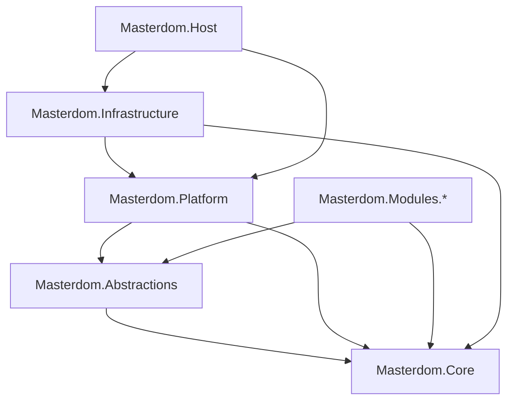
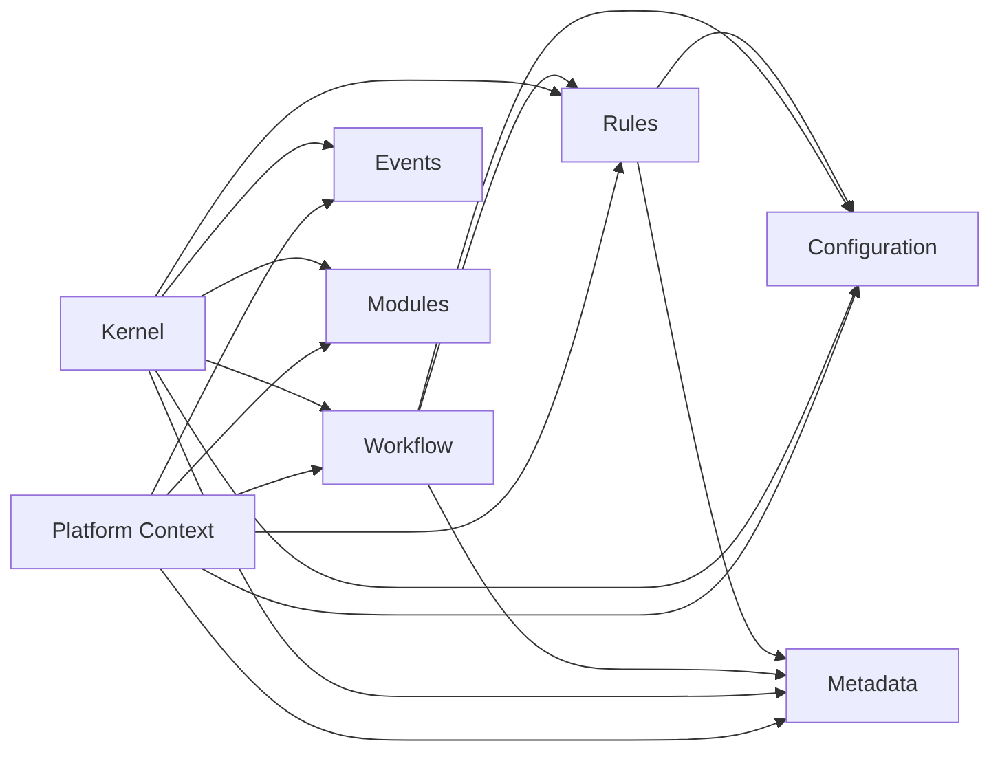

# PDP-008 Platform Architecture Stabilization

- Document ID: ARCH-PLATFORM-008
- Title: Platform Architecture Stabilization
- Version: 1.0
- Status: Active
- Owner: Platform Engineering
- Last Updated: 2026-08-03
- Next Review: [TBD]
- Related Handbook: [docs/architecture/MASTERDOM_ARCHITECTURE_HANDBOOK.md](MASTERDOM_ARCHITECTURE_HANDBOOK.md)
- Related Gap Register: [docs/architecture/ARCHITECTURE_GAP_REGISTER.md](ARCHITECTURE_GAP_REGISTER.md)

## Scope and Constraints

PDP-008 is a stabilization package.

No new business capabilities are introduced.

No new framework is introduced.

The package verifies and freezes the public architecture baseline for:

- Configuration
- Metadata
- Rules
- Workflow
- Events
- Kernel
- Platform Context
- Module Catalog

## Deliverable 1: Platform Dependency Diagram

Framework-level dependency flow inside Platform:

## Deliverable 2: Framework Matrix

| Framework        | Public Interfaces                                                                                                                             | Primary Implementations                                                                                                                             | Repository | Resolver              | Registry | Catalog/Builder                          | Validator                                | Persistence Adapter                          | Tests                                                                                                  | Documentation                      |
| ---------------- | --------------------------------------------------------------------------------------------------------------------------------------------- | --------------------------------------------------------------------------------------------------------------------------------------------------- | ---------- | --------------------- | -------- | ---------------------------------------- | ---------------------------------------- | -------------------------------------------- | ------------------------------------------------------------------------------------------------------ | ---------------------------------- |
| Configuration    | IConfigurationRepository, IConfigurationResolver, IConfigurationDefaults                                                                      | ConfigurationResolver, InMemoryConfigurationRepository, DefaultConfigurationDefaults                                                                | Yes        | Yes                   | No       | ConfigurationCatalogBuilder              | PlatformConfigurationValidationException | PlatformConfigurationRepository + EF mapping | ConfigurationResolverTests, PlatformConfigurationRepositoryTests                                       | CONFIGURATION_FRAMEWORK.md         |
| Metadata         | IMetadataRepository, IMetadataResolver, IMetadataRegistry, IMetadataCatalog                                                                   | MetadataResolver, MetadataRegistry, InMemoryMetadataRepository                                                                                      | Yes        | Yes                   | Yes      | MetadataCatalogBuilder, MetadataCatalog  | MetadataValidation                       | PlatformMetadataRepository + EF mapping      | MetadataResolverTests, MetadataRegistryTests, MetadataValidationTests, PlatformMetadataRepositoryTests | METADATA_FRAMEWORK.md              |
| Rules            | IRuleRepository, IRuleResolver, IRuleRegistry, IRuleCatalog                                                                                   | RuleResolver, RuleRegistry, InMemoryRuleRepository                                                                                                  | Yes        | Yes                   | Yes      | RuleCatalogBuilder, RuleCatalog          | RuleValidation                           | PlatformRuleRepository + EF mapping          | RuleResolverTests, RuleValidationTests, PlatformRuleRepositoryTests                                    | RULES_ENGINE.md                    |
| Workflow         | IWorkflowRepository, IWorkflowResolver, IWorkflowRegistry, IWorkflowCatalog, IWorkflowStateStore                                              | WorkflowResolver, WorkflowRegistry, InMemoryWorkflowRepository, InMemoryWorkflowStateStore                                                          | Yes        | Yes                   | Yes      | WorkflowCatalogBuilder, WorkflowCatalog  | WorkflowValidation                       | PlatformWorkflowRepository + EF mapping      | WorkflowResolverTests, WorkflowValidationTests, PlatformWorkflowRepositoryTests                        | WORKFLOW_ENGINE.md                 |
| Events           | IEventRepository, IEventStore, IEventPublisher, IEventDispatcher, IEventHandlerResolver, IEventRegistry, IEventCatalog, IDomainEventPublisher | EventStore, EventPublisher, EventDispatcher, EventHandlerResolver, EventRegistry, DomainEventPublisher, DomainEventAdapter, InMemoryEventRepository | Yes        | Yes                   | Yes      | EventCatalogBuilder, EventCatalog        | EventValidationException                 | In-memory only in current phase              | EventPipelineTests, DomainEventPublisherTests, KernelEventIntegrationTests                             | EVENT_INFRASTRUCTURE.md            |
| Kernel + Context | IPlatformContext                                                                                                                              | Kernel, PlatformContext                                                                                                                             | N/A        | N/A                   | N/A      | ModuleStartupGraphBuilder (module-level) | KernelHealthCheck                        | N/A                                          | KernelTests, KernelEventIntegrationTests                                                               | MASTERDOM_ARCHITECTURE_HANDBOOK.md |
| Module Catalog   | IPlatformModuleCatalog, IModuleCatalog, IModuleRegistry, IModuleLoader                                                                        | PlatformModuleCatalog, ModuleRegistry, ModuleLoader, ModuleStartupGraphBuilder                                                                      | N/A        | Discovery is separate | Yes      | ModuleStartupGraphBuilder                | ModuleCatalogValidator, ModuleValidator  | N/A                                          | ModuleRegistryTests, ModuleLoaderTests, KernelTests                                                    | PLATFORM_MODULE_CATALOG.md         |

## Deliverable 3: Architecture Consistency Report

### Public API Review

- The framework surface is broad but coherent.
- All major frameworks expose explicit repository and resolver abstractions.
- Configuration intentionally differs by not exposing a dedicated registry abstraction.
- Rules and Workflow have explicit cross-framework dependencies through constructor-injected resolvers.

Findings:

- No duplicate type names that cause API collision were identified.
- Pattern inconsistency exists between Configuration and other frameworks for Registry/Catalog mutation flows.
- Event persistence currently has two adjacent abstractions (IEventRepository and IEventStore) with overlapping concerns.

### Dependency Review

- Project references follow dependency direction:
  - Core as the innermost base.
  - Platform and Abstractions above Core.
  - Infrastructure above Platform/Core.
  - Host above Platform and Infrastructure.
- No project-level cycles were identified.
- Domain does not depend on Infrastructure at project level.
- Kernel orchestrates all platform framework dependencies.

### Pattern Review

Consistent patterns in most frameworks:

- Resolver
- Repository
- Catalog/Builder
- Validator
- Result and Context DTOs
- Version and Scope value objects

Primary variance:

- Configuration does not expose Registry/Catalog in the same way as Metadata/Rules/Workflow/Events.

### Value Object Review

The platform consistently uses immutable value objects with constructor guard clauses for:

- Identifiers: ConfigurationId, MetadataId, RuleId, WorkflowId, EventId
- Version types: ConfigurationVersion, MetadataVersion, RuleVersion, WorkflowVersion, EventVersion
- Scope types: ConfigurationScope, MetadataScope, RuleScope, WorkflowScope
- Effective period types: EffectivePeriod, MetadataEffectivePeriod, RuleEffectivePeriod, WorkflowEffectivePeriod

### Versioning Review

- Version and effective-date semantics are implemented across Configuration, Metadata, Rules, and Workflow.
- Deprecation/replacement/compatibility metadata is implemented in Metadata, Rules, and Workflow version definitions.
- Events currently use EventVersion without effective-date activation.

### Persistence Review

- Infrastructure adapters map platform abstractions using EF entities and Fluent API configuration.
- No EF DbContext or IQueryable leakage was identified in platform public interfaces.
- Migration naming is consistent and timestamp-prefixed.
- Event persistence remains in-memory by design for this phase.

### Test Review

Coverage exists for each core framework area.

Additional stabilization gaps:

- Cross-framework integration tests are still sparse outside kernel/event startup paths.
- Platform context contract tests can be broadened for complete service exposure assertions.
- Architecture test project remains largely unimplemented.

### Documentation Review

- Framework docs exist for Configuration, Metadata, Rules, Workflow, and Events.
- Gap register aligns with phase-2 status for these frameworks.
- Architecture index now includes this PDP-008 stabilization baseline.

### Performance Review (Architectural)

- Startup wiring is eager inside Kernel with many concrete object allocations.
- Resolver patterns generally perform in-memory filtering and ordering per call.
- No critical architectural performance blockers were identified for current baseline scale.

### Extensibility Review

Readiness summary:

- Search: contracts not yet present.
- Reporting: module scaffold exists, no framework implementation.
- Notifications: module scaffold exists, no framework implementation.
- Messaging: not implemented; explicitly deferred.
- Scheduling: not implemented.
- Audit: partial via events, no dedicated audit framework.
- Multi-domain: module boundaries exist, most business modules are still scaffold-level.
- Multi-tenancy: scope primitives exist; end-to-end tenant enforcement remains future work.

## Deliverable 4: Technical Debt Register

| ID         | Debt Item                                                                                | Impact                                           | Priority | Proposed Package                    |
| ---------- | ---------------------------------------------------------------------------------------- | ------------------------------------------------ | -------- | ----------------------------------- |
| TD-008-001 | Configuration framework lacks Registry/Catalog mutation symmetry with other frameworks   | Increases cognitive variance                     | Medium   | PKG-Configuration-Framework-Phase2  |
| TD-008-002 | Event storage abstractions (IEventRepository and IEventStore) may overlap responsibility | API ambiguity for future persistence             | Medium   | PKG-Event-Infrastructure-Phase2     |
| TD-008-003 | Kernel constructs many concrete framework implementations directly                       | Reduced composition flexibility                  | Medium   | PKG-Platform-Composition-Refinement |
| TD-008-004 | Cross-framework interaction tests are limited                                            | Regression risk on framework integration changes | High     | PKG-Architecture-Tests-Expansion    |
| TD-008-005 | Architecture tests project baseline remains minimal                                      | Governance enforcement gap                       | High     | PKG-Architecture-Tests-Expansion    |

## Deliverable 5: Framework Standardization Report

Standardization status:

- Implemented and consistent:
  - Value object construction and invariants
  - Resolver/repository abstractions
  - Validation exception patterns
  - Effective-date sorting with version tie-breakers
- Partial:
  - Registry/Catalog parity across all frameworks
  - Kernel composition strategy consistency (interface-first construction)
- Deferred intentionally:
  - External messaging/outbox delivery
  - Scheduling and notification framework integration

Minimal standardization actions recommended:

1. Define a shared guidance note for when a framework must expose Registry/Catalog, and when Resolver+Repository is sufficient.
2. Clarify boundary between IEventStore and IEventRepository in architecture docs and interface comments.
3. Add one platform integration test suite that exercises Configuration + Metadata + Rules + Workflow together in a single startup/runtime flow.

## Deliverable 6: Architecture Improvement Backlog

| Backlog Item                                                                                    | Type            | Effort | Expected Outcome                                   |
| ----------------------------------------------------------------------------------------------- | --------------- | ------ | -------------------------------------------------- |
| Formalize platform framework surface conventions (Registry/Catalog/Resolver patterns)           | Standardization | Low    | Reduced API variance and clearer contributor rules |
| Add architecture conformance tests for dependency direction and layer boundaries                | Governance      | Medium | Automated prevention of architectural drift        |
| Introduce kernel composition seam for resolver/repository factory injection                     | Composition     | Medium | Improved testability and runtime substitution      |
| Expand platform context contract tests for complete interface exposure and lifecycle invariants | Quality         | Medium | Higher confidence in module-facing API stability   |
| Prepare phase-2 event persistence contract clarification (store vs repository)                  | API hardening   | Low    | Cleaner path to outbox-enabled persistence         |

## Freeze Decision

PDP-008 freezes the current public platform architecture as the baseline for future framework work.

Any future framework package must preserve existing public contracts unless an explicit ADR supersedes them.

## MASTERDOM BASELINE v1 Freeze

MASTERDOM BASELINE v1 is the authoritative implementation baseline.

The following architecture assets are frozen:

- Configuration Framework
- Business Configuration Architecture
- Business Configuration Asset Standard
- Import / Export Platform
- Language Support Platform
- Business Context Platform
- Recommendation Platform Architecture
- Recommendation / Decision Architecture
- Reporting Read Model Architecture
- Notification Architecture
- Documents Architecture
- Subsidy Optimizer Architecture
- Platform Governance
- Platform Asset Lifecycle
- Dependency Direction

Future implementation must conform to this baseline.

## Change Governance for Frozen Architecture

Changes to frozen architecture require all of the following:

- documented architectural rationale
- impact analysis
- backward compatibility assessment
- migration strategy when applicable
- documentation updates across affected architecture assets

Implementation changes alone are not sufficient justification for architecture changes.

## Official Implementation Baseline Sequence

1. Phase 1: Business Context Platform
2. Phase 2: Recommendation Platform (generic contracts only: Recommendation, Recommendation Bundle, Decision, Optimization Session)
3. Phase 3: Subsidy Maximizer v1
4. Phase 4: Calculation Engine Discovery
5. Phase 5: Calculation Engine
6. Phase 6: Refactor Subsidy Maximizer to consume Calculation Engine

## Architecture Principle After Freeze

Prefer implementation over architectural expansion.

Introduce new architecture only when implementation reveals a genuine architectural deficiency.
