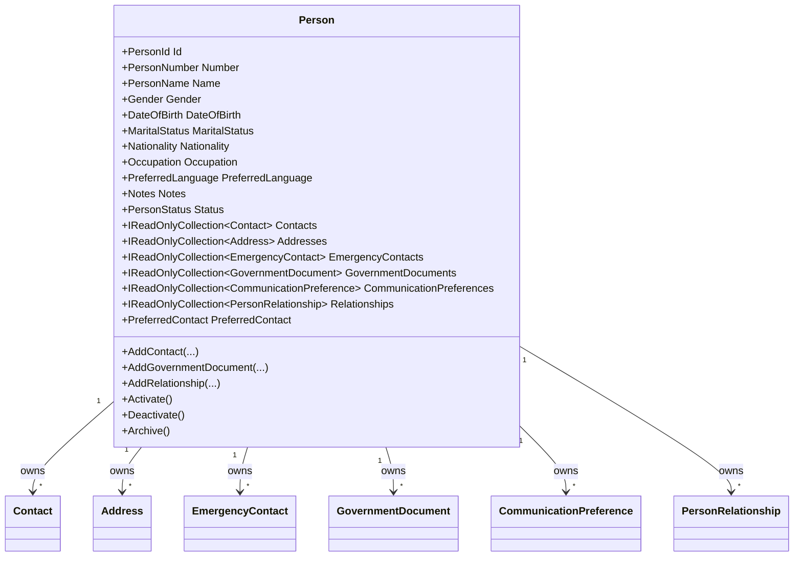

# Person Domain Foundation

- Document ID: ARCH-DOMAIN-002
- Title: Person Domain Foundation
- Version: 1.0
- Status: Active
- Owner: Domain Engineering
- Last Updated: 2026-07-27
- Next Review: [TBD]
- Related ADRs: [docs/adr/ADR-0004_Domain_Boundaries.md](../adr/ADR-0004_Domain_Boundaries.md)
- Related Standards: [docs/standards/ENG-001_Engineering_Standards.md](../standards/ENG-001_Engineering_Standards.md)
- Related Playbooks: [docs/playbooks/MODULE_DEVELOPMENT_GUIDE.md](../playbooks/MODULE_DEVELOPMENT_GUIDE.md)

## Purpose

Establish the Person bounded-context foundation as Masterdom's universal business identity model.

This foundation does not implement authentication or authorization.

## Scope

This document covers:

- Person aggregate boundary and lifecycle
- Business identity attributes and identifiers
- Contact and communication model
- Identity documents and extensible relationship model
- Application-layer orchestration and repository boundary
- Platform abstraction consumption via orchestrator

This document does not define Users, Login, OAuth, JWT, Passwords, Tenancy, Leasing, Billing, or Authorization behavior.

## Aggregate Model

## Domain Events

Person aggregate emits:

- PersonCreatedDomainEvent
- PersonUpdatedDomainEvent
- ContactAddedDomainEvent
- ContactRemovedDomainEvent
- IdentityDocumentAddedDomainEvent
- RelationshipAddedDomainEvent

## Application Boundary

People module application layer follows the Property-module pattern:

- Commands, queries, handlers
- Application service orchestration
- Repository contract
- Unit-of-work abstraction
- Platform orchestrator
- Execution results

## Persistence Boundary

Infrastructure adapts the Person aggregate with EF Core mappings.

- Emergency contacts are persisted through owned collection mapping.
- Communication preferences and relationships are persisted through owned collections.
- Domain events remain in-memory and are ignored by EF mappings.

## Platform Integration

People operations consume platform abstractions through an orchestrator:

- Configuration
- Metadata
- Rules
- Workflow
- Event publishing via domain-event publisher

## Implemented Application & API Surface

The following Person aggregate operations are exposed through complete vertical slices (command/query, handler, service, DI, authorization, endpoint, tests):

### Commands
- `CreatePersonCommand` - Create new person identity
- `RenamePersonCommand` - Update person name
- `ChangePersonStatusCommand` - Update person status (Activate, Deactivate, Archive)
- `AddContactCommand` - Add contact channel
- `RemoveContactCommand` - Remove contact channel
- `AddIdentityDocumentCommand` - Add government-issued document
- `AddRelationshipCommand` - Add relationship link to another person

### Queries
- `GetPersonByIdQuery` - Retrieve person by PersonId
- `GetPersonByNumberQuery` - Retrieve person by PersonNumber
- `SearchPeopleQuery` - Search persons by number prefix with pagination

### Handlers
- Command handlers registered via dependency injection for all commands above
- Query handlers registered via dependency injection for all queries above
- Authorization decorators applied to all handlers

### API Endpoints
- `POST /api/people` - Create person
- `PUT /api/people/{personId}/name` - Rename person
- `PUT /api/people/{personId}/status` - Change person status
- `POST /api/people/{personId}/contacts` - Add contact
- `POST /api/people/{personId}/contacts/remove` - Remove contact
- `POST /api/people/{personId}/documents` - Add identity document
- `POST /api/people/{personId}/relationships` - Add relationship
- `GET /api/people/{personId}` - Get person by ID
- `GET /api/people/by-number/{number}` - Get person by number
- `GET /api/people/search` - Search people

### Infrastructure
- Repository: `IPersonRepository` with EF Core implementation
- Unit of Work: `IPersonUnitOfWork` with transaction support
- Platform Orchestrator: `IPersonPlatformOrchestrator` for platform abstraction integration
- Persistence: Complete EF Core configuration including owned collections for addresses, contacts, emergency contacts, government documents, communication preferences, and relationships
- Authorization: All operations mapped to capability-based authorization policies

## Reserved Capabilities

The Person aggregate includes additional public operations that are intentionally modeled, persisted, and documented but are not currently exposed through application/API layers because no current Stage 2 repository workflow requires them.

These capabilities are **not missing implementation** but are **reserved** for future workflows:

### Attribute Modification Operations (Reserved)
- `ChangeGender()` - Update gender
- `SetDateOfBirth()` - Update date of birth
- `SetMaritalStatus()` - Update marital status
- `SetNationality()` - Update nationality
- `SetOccupation()` - Update occupation
- `SetPreferredLanguage()` - Update preferred language
- `SetNotes()` - Update internal notes
- `ChangeDescription()` - Update description
- `ChangeRemarks()` - Update remarks
- `ChangeOther()` - Update extensible other field

### Collection & Reference Operations (Reserved)
- `AddAddress()` / `RemoveAddress()` - Address lifecycle management
- `AddEmergencyContact()` / `RemoveEmergencyContact()` - Emergency contact lifecycle
- `RemoveGovernmentDocument()` - Remove government document (AddGovernmentDocument is exposed via AddIdentityDocumentCommand)
- `SetPreferredContact()` - Set preferred contact method
- `AddCommunicationPreference()` - Add communication preference
- `RemoveRelationship()` - Remove relationship link (AddRelationship is exposed via AddRelationshipCommand)

### Lifecycle & Display Operations (Reserved)
- `SetEffectivePeriod()` - Set effective from/to dates
- `SetDisplayOrder()` - Set sort order
- `Hide()` / `Show()` - Visibility control

### Evidence of Reservation
- All reserved operations are defined in the Person aggregate domain model
- All are persisted through EF Core configuration
- None have corresponding commands, handlers, or endpoints
- Cross-module workflow analysis found no current requirements for these operations
- These operations support aggregate integrity and are available for future use

## Current Limitations

- Person aggregate ownership has been consolidated into the People module domain namespace.
- PersonId remains in the shared kernel identifiers namespace to avoid cross-module cycles.
- Person-to-tenancy ownership contracts are not implemented.
- Authentication and authorization concerns remain outside this bounded context.

## Next Package Guidance

Before tenancy implementation:

1. Introduce explicit tenancy-to-person contracts through IDs only.
2. Add read-model projections for person search and matching.
3. Define anti-corruption contracts between Person and Identity profile lifecycles.
