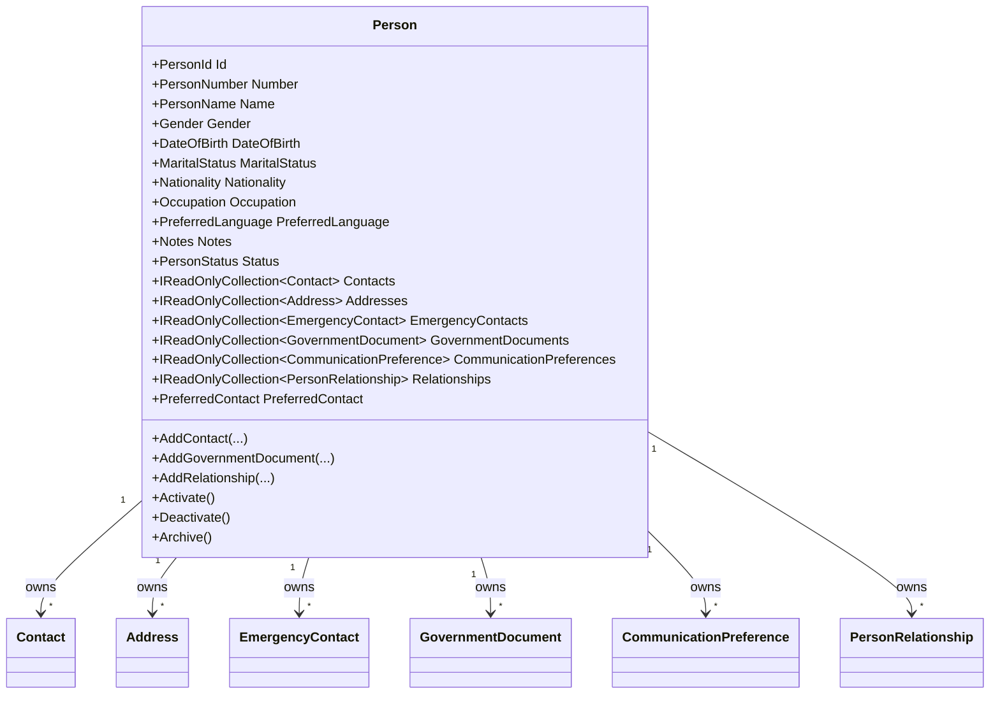

# Person Domain Foundation

- Document ID: ARCH-DOMAIN-002
- Title: Person Domain Foundation
- Version: 1.0
- Status: Active
- Owner: Domain Engineering
- Last Updated: 2026-07-27
- Next Review: [TBD]
- Related ADRs: [docs/adr/ADR-0004_Domain_Boundaries.md](../adr/ADR-0004_Domain_Boundaries.md)
- Related Standards: [docs/standards/ENG-001_Engineering_Standards.md](../standards/ENG-001_Engineering_Standards.md)
- Related Playbooks: [docs/playbooks/MODULE_DEVELOPMENT_GUIDE.md](../playbooks/MODULE_DEVELOPMENT_GUIDE.md)

## Purpose

Establish the Person bounded-context foundation as Masterdom's universal business identity model.

This foundation does not implement authentication or authorization.

## Scope

This document covers:

- Person aggregate boundary and lifecycle
- Business identity attributes and identifiers
- Contact and communication model
- Identity documents and extensible relationship model
- Application-layer orchestration and repository boundary
- Platform abstraction consumption via orchestrator

This document does not define Users, Login, OAuth, JWT, Passwords, Tenancy, Leasing, Billing, or Authorization behavior.

## Aggregate Model

## Domain Events

Person aggregate emits:

- PersonCreatedDomainEvent
- PersonUpdatedDomainEvent
- ContactAddedDomainEvent
- ContactRemovedDomainEvent
- IdentityDocumentAddedDomainEvent
- RelationshipAddedDomainEvent

## Application Boundary

People module application layer follows the Property-module pattern:

- Commands, queries, handlers
- Application service orchestration
- Repository contract
- Unit-of-work abstraction
- Platform orchestrator
- Execution results

## Persistence Boundary

Infrastructure adapts the Person aggregate with EF Core mappings.

- Emergency contacts are persisted through owned collection mapping.
- Communication preferences and relationships are persisted through owned collections.
- Domain events remain in-memory and are ignored by EF mappings.

## Platform Integration

People operations consume platform abstractions through an orchestrator:

- Configuration
- Metadata
- Rules
- Workflow
- Event publishing via domain-event publisher

## Current Limitations

- Person aggregate ownership has been consolidated into the People module domain namespace.
- PersonId remains in the shared kernel identifiers namespace to avoid cross-module cycles.
- Person-to-tenancy ownership contracts are not implemented.
- Authentication and authorization concerns remain outside this bounded context.

## Next Package Guidance

Before tenancy implementation:

1. Introduce explicit tenancy-to-person contracts through IDs only.
2. Add read-model projections for person search and matching.
3. Define anti-corruption contracts between Person and Identity profile lifecycles.
