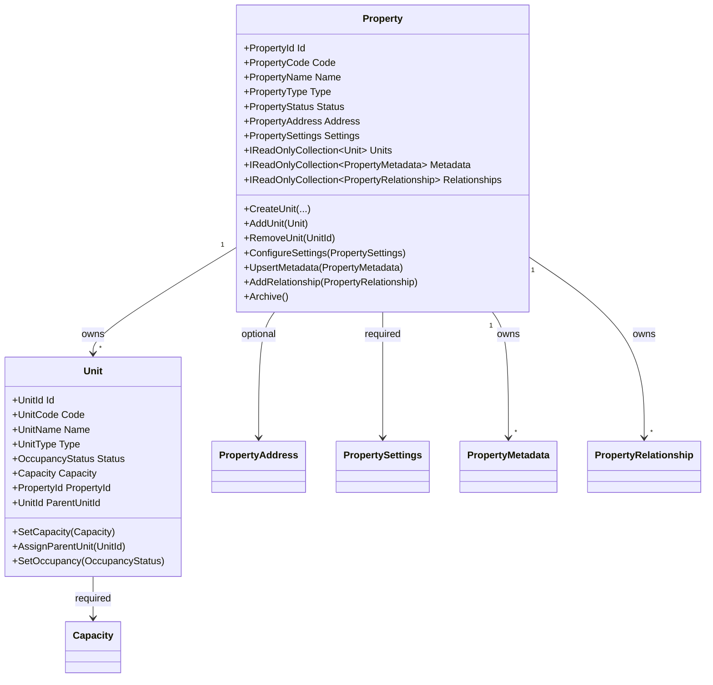

# Property Domain Foundation

- Document ID: ARCH-DOMAIN-001
- Title: Property Domain Foundation
- Version: 1.0
- Status: Active
- Owner: Domain Engineering
- Last Updated: 2026-07-27
- Next Review: [TBD]
- Related ADRs: [docs/adr/ADR-0004_Domain_Boundaries.md](../adr/ADR-0004_Domain_Boundaries.md)
- Related Standards: [docs/standards/ENG-001_Engineering_Standards.md](../standards/ENG-001_Engineering_Standards.md)
- Related Playbooks: [docs/playbooks/MODULE_DEVELOPMENT_GUIDE.md](../playbooks/MODULE_DEVELOPMENT_GUIDE.md)

## Purpose

Establish the initial Property domain model as the first business-domain consumer of platform frameworks.

This foundation validates domain-to-platform integration without introducing property-management business features.

## Scope

This document covers:

- Property aggregate boundary and invariants
- Unit child-entity ownership and lifecycle constraints
- Property domain value objects and identifiers
- Domain-event integration with platform event infrastructure
- Rules, configuration, metadata, and workflow consumption validation

This document does not define Leasing, Billing, Tenant, Accounting, Notification, Search, Reporting, or Document capabilities.

## Aggregate Model

Property is the aggregate root and owns Unit entities.

## Invariants

Property invariants:

- Property code is immutable after creation.
- Property cannot set itself as parent property.
- Effective-from cannot be after effective-to.
- Property type cannot change after units exist.
- Archived property cannot accept new units.
- Property with units cannot be archived.
- Unit code must be unique per property.
- Relationship target cannot reference self.
- Metadata keys are normalized and unique by key within property.

Unit invariants:

- Capacity must be greater than zero.
- Unit cannot set itself as parent unit.
- Unit cannot be reassigned to another property once attached.
- Display order cannot be negative.

## Platform Consumption

The Property domain foundation validates consumption of:

- Configuration: property-scoped and module-scoped rule inputs
- Metadata: module metadata resolution in property flows
- Rules: property decisions using RuleResolver with config/metadata dependencies
- Workflow: property lifecycle orchestration baseline execution
- Events: domain events adapted and published through DomainEventPublisher

No platform public contracts were modified for PDP-009.

## Domain Events

Property aggregate emits domain facts:

- PropertyCreatedDomainEvent
- PropertyRenamedDomainEvent
- PropertyStatusChangedDomainEvent
- UnitCreatedDomainEvent
- UnitRemovedDomainEvent

These events are consumed by platform adapters through `IHasDomainEvents` and `DomainEventPublisher`.

## Persistence Mapping

Persistence remains infrastructure-owned:

- `properties` table remains aggregate root storage.
- `property_units` table remains child-entity storage.
- Owned collections:
  - `property_metadata`
  - `property_relationships`
- Owned single-value objects:
  - address fields on `properties`
  - settings fields on `properties`
- Unit capacity and parent-unit relationship are mapped in `property_units`.

EF mapping ignores in-memory domain events.

## Current Limitations

- Property domain and application boundary are now implemented in `Masterdom.Modules.Properties` with command/query handlers and repository-driven orchestration.
- No tenant ownership model is implemented in Property aggregate yet.
- No leasing, billing, or occupancy accounting workflows are implemented.

## Application Boundary Status

PDP-011 established application-layer orchestration for Properties without changing domain behavior:

- Commands and handlers: CreateProperty, RenameProperty, ChangeStatus, CreateUnit, RemoveUnit.
- Queries and handlers: GetPropertyById, GetPropertyByCode, ListUnits, SearchProperties.
- Transaction boundary: application service delegates persistence commits to a unit-of-work abstraction.
- Platform consumption: application orchestration invokes configuration, metadata, rules, workflow, and domain-event publication through platform abstractions.
- Persistence boundary: repositories remain infrastructure adapters, and EF Core is not referenced from module application code.

## Next Package Guidance

Before Tenant domain implementation:

1. Add broader persistence and integration tests dedicated to Properties module boundaries.
2. Define tenant-to-property ownership model with explicit aggregate references.
3. Expand property workflow/rule catalogs from validation baseline to governed business policies.
