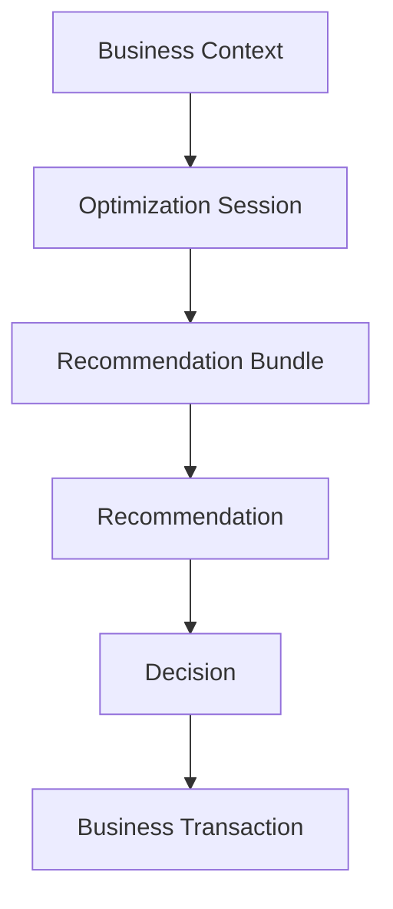
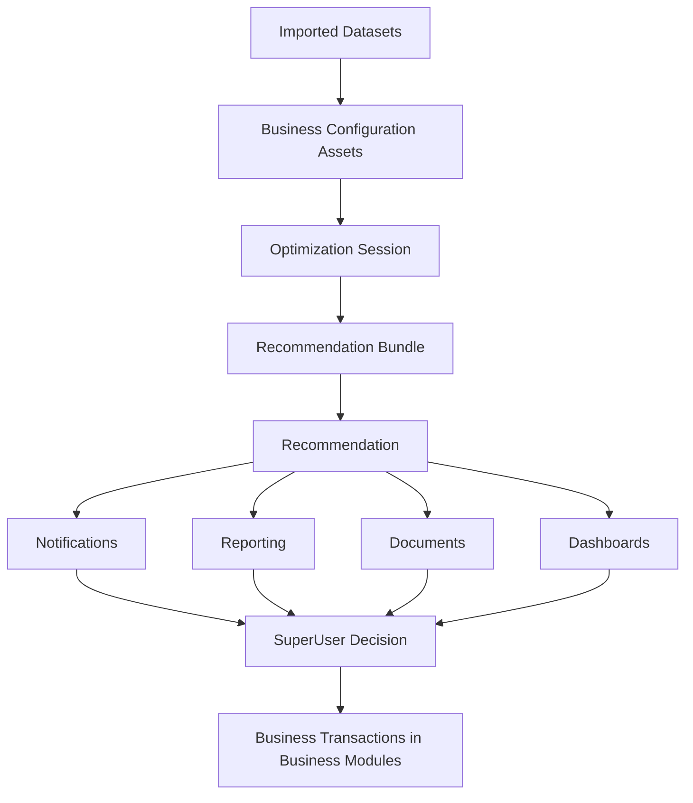

# Recommendation and Decision Architecture

- Document ID: ARCH-CROSSCUT-RECOMMENDATION-001
- Title: Recommendation and Decision Architecture
- Version: 1.0
- Status: Active
- Owner: Platform and Domain Engineering
- Last Updated: 2026-08-03
- Next Review: [TBD]
- Related ADRs: [docs/adr/ADR-0001_Modular_Architecture.md](../adr/ADR-0001_Modular_Architecture.md), [docs/adr/ADR-0002_Configuration_First.md](../adr/ADR-0002_Configuration_First.md), [docs/adr/ADR-0004_Domain_Boundaries.md](../adr/ADR-0004_Domain_Boundaries.md), [docs/adr/ADR-0005_Versioned_Configuration.md](../adr/ADR-0005_Versioned_Configuration.md)
- Related Standards: [docs/standards/ENG-001_Engineering_Standards.md](../standards/ENG-001_Engineering_Standards.md), [docs/standards/BUSINESS_CONFIGURATION_ASSET_STANDARD.md](../standards/BUSINESS_CONFIGURATION_ASSET_STANDARD.md)
- Related Playbooks: [docs/playbooks/PLATFORM_DEVELOPMENT_GUIDE.md](../playbooks/PLATFORM_DEVELOPMENT_GUIDE.md)

## Core Principle

Recommendation, Decision, and Business Transaction are independent concepts.

Recommendation

-> Decision

-> Business Transaction

They must not be merged.

Recommendation and Decision architecture consumes Business Context Platform outputs for intelligent-module analysis input.

## Optimization Session Architecture

Optimization Session (Optimization Run Context) represents one complete optimization execution.

Applicable producers include Subsidy optimization and future optimization capabilities in other modules.

Optimization Session owns:

- Session Id
- Session Type
- Session Version
- Source Module
- Started Timestamp
- Completed Timestamp
- Execution Status
- Execution Duration
- User
- Business Context
- Configuration Versions
- Imported Dataset References
- Execution Parameters
- Recommendation Bundle
- Decision References
- Execution Audit

Optimization Sessions become immutable after completion.

## Recommendation Bundle Architecture

Recommendations are grouped under a Recommendation Bundle.

Recommendation Bundle owns:

- Bundle Id
- Bundle Version
- Bundle Objective
- Overall Confidence
- Overall Expected Benefit
- Overall Expected Risk
- Overall Trade-offs
- Ordered Recommendation List
- Bundle Status

Each Recommendation Bundle belongs to exactly one Optimization Session.

## Recommendation Architecture

Recommendation is system-generated analysis output.

Recommendation is immutable after generation.

Recommendation is not a business transaction and is not a user decision.

Minimum recommendation information:

- Recommendation Id
- Recommendation Type
- Recommendation Version
- Status
- Source Module
- Generated Timestamp
- Generated By
- Configuration Versions
- Optimization Strategy
- Optimization Models
- Confidence Score
- Priority
- Recommendation Summary
- Recommendation Explanation
- Recommendation Evidence
- Expected Benefits
- Expected Risks
- Trade-offs
- Affected Properties
- Affected Units
- Related Reports
- Related Documents
- Related Notifications
- Expiration
- Superseded By

### Recommendation Evidence Value Object

RecommendationEvidence is a dedicated value object that stores immutable references to evidence used by recommendation generation.

Typical evidence references include:

- Meter readings
- Historical consumption
- Imported datasets
- Tariff versions
- Policy versions
- Formula versions
- Optimization model versions
- Occupancy history
- Confidence calculations
- Supporting charts
- Supporting documents

### Recommendation Explanation Value Object

RecommendationExplanation is a dedicated value object that stores explainability content.

It contains:

- Executive Summary
- Detailed Explanation
- Assumptions
- Constraints
- Expected Benefits
- Expected Risks
- Trade-offs
- Alternatives Considered

## Recommendation Lifecycle

Minimum lifecycle states:

- Draft
- Generated
- Under Review
- Accepted
- Partially Accepted
- Rejected
- Deferred
- Expired
- Superseded
- Cancelled

Recommendation lifecycle is versioned.

Recommendation content remains immutable after generation.

Lifecycle transitions are captured through auditable records.

## Decision Architecture

Decision is independent from Recommendation.

Decision represents human governance action.

Decision is created by SuperUser or authorized governance roles.

Minimum decision information:

- Decision Id
- Decision Type
- Decision Status
- Decision Timestamp
- Decision Maker
- Decision Notes
- Decision Reason
- Related Recommendation
- Approval Comments
- Partial Acceptance Details
- Execution Request

## Decision Lifecycle

Minimum decision lifecycle states:

- Created
- Pending Review
- Approved
- Partially Approved
- Rejected
- Deferred
- Cancelled
- Executed
- Execution Failed
- Closed

## Business Transaction Boundary

Business transactions remain inside Business Modules.

Business transactions do not originate directly from Recommendation.

Business transactions execute only after approved Decision.

## Ownership

Recommendation is produced by intelligent modules.

Decision is produced by human governance.

Business transactions are executed by business modules.

Subsidy Maximizer is a producer of recommendations and does not auto-apply them.

## Dependency Direction

Extended downstream consumption view:

Business modules consume approved decisions, not raw recommendations.
