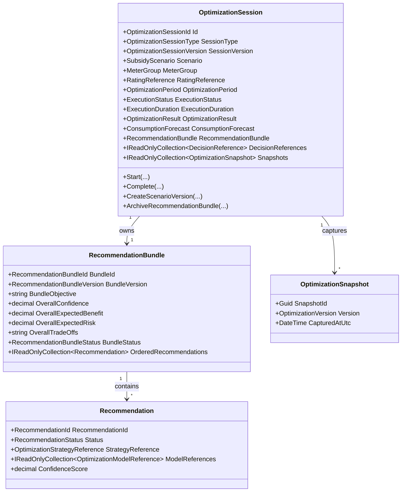
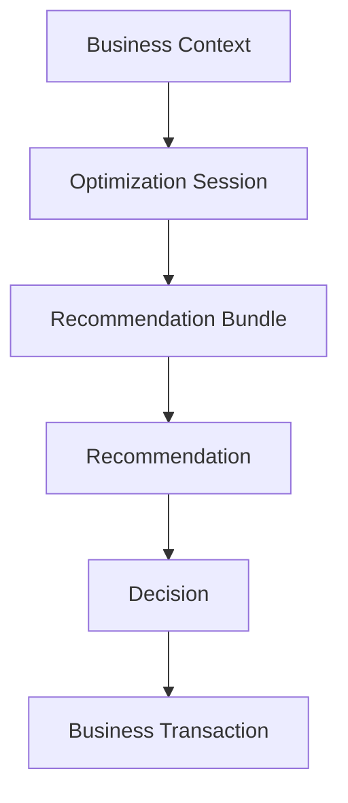

# Subsidy Optimization Foundation

- Document ID: ARCH-DOMAIN-008
- Title: Subsidy Optimization Foundation
- Version: 1.0
- Status: Active
- Owner: Domain Engineering
- Last Updated: 2026-08-03
- Next Review: [TBD]
- Related ADRs: [docs/adr/ADR-0002_Configuration_First.md](../adr/ADR-0002_Configuration_First.md), [docs/adr/ADR-0005_Versioned_Configuration.md](../adr/ADR-0005_Versioned_Configuration.md)
- Related Standards: [docs/standards/ENG-001_Engineering_Standards.md](../standards/ENG-001_Engineering_Standards.md)
- Related Playbooks: [docs/playbooks/MODULE_DEVELOPMENT_GUIDE.md](../playbooks/MODULE_DEVELOPMENT_GUIDE.md)

## Purpose

Establish the Subsidy Optimization bounded context as an advisory and simulation engine that analyzes contract-based consumption/rating inputs and produces versioned recommendations.

## Scope

This foundation includes:

- Optimization Session (Optimization Run Context) ownership and lifecycle
- Scenario/version modeling for immutable optimization history
- Recommendation Bundle generation as advisory output
- Snapshot persistence for deterministic replay
- Platform configuration/rules/workflow consumption through orchestrator

This foundation excludes tariff ownership, policy ownership, provider ownership, recommendation lifecycle ownership, decision lifecycle ownership, meter readings, rated consumption ownership, bill generation, payments, ledger posting, forecast mathematics, machine learning, and geography-specific subsidy rules.

## Refined Architecture

Subsidy Maximizer is an advisory business module.

It is responsible for:

- analyze
- predict
- optimize
- compare scenarios
- score confidence
- generate recommendations

It is not responsible for:

- modifying bills
- modifying meter readings
- redistributing loads directly
- changing tenancy state
- changing rates or tariffs
- applying recommendations automatically

Recommendation application remains a SuperUser-governed decision followed by explicit audited business operations in owning modules.

Recommendation, Decision, and Business Transaction are independent concepts.

Recommendation -> Decision -> Business Transaction

## Read-Only Findings

- Subsidy references exist in ADR and roadmap-level governance, but no domain implementation currently exists.
- Utility Rating establishes contract-based, versioned rated consumption output and explicit tariff references.
- Metering and Billing boundaries explicitly exclude subsidy logic.
- Configuration, Rules, and Workflow frameworks are version-aware and deterministic, suitable as runtime dependencies.
- Business documentation folder has no dedicated subsidy specification artifacts yet.
- Repository memory confirms prior migration and domain-event conventions relevant to this package.

## Ownership Boundaries

Subsidy Optimization owns:

- SubsidyScenario
- OptimizationSession
- RecommendationBundle
- OptimizationSnapshot
- OptimizationVersion
- MeterGroup
- ConsumptionForecast
- OptimizationResult

Subsidy Optimization does not own:

- Meter readings
- Rated consumption source records
- Bills
- Payments
- Ledger
- Tariff definitions
- Recommendation domain lifecycle and persistence
- Decision lifecycle and persistence

Subsidy Optimization also does not own:

- Formula Catalog
- Rate Catalog
- Tariff Catalog
- Policy Catalog
- Penalty Catalog
- Optimization Model Catalog
- Optimization Strategy Catalog
- Provider Catalog
- Import Definition Catalog
- Language Resource Catalog
- Report Definition Catalog
- Notification Template Catalog
- Document Template Catalog

It consumes these business configuration assets.

Subsidy Optimization consumes Business Context Platform snapshots as read-only execution input and does not reconstruct cross-module context independently.

## Business Configuration Assets Consumed

- Formula Catalog
- Rate Catalog
- Tariff Catalog
- Policy Catalog
- Penalty Catalog
- Optimization Model Catalog
- Optimization Strategy Catalog
- Provider Catalog
- Import Definition Catalog
- Language Resource Catalog
- Report Definition Catalog
- Notification Template Catalog
- Document Template Catalog

### Catalog Clarifications

- Optimization Model Catalog replaces the narrower prediction-only concept and includes prediction, optimization, recommendation ranking, confidence, and scenario-comparison models.
- Tariff Catalog remains provider-independent (for example, Residential Electricity Tariff, Commercial Electricity Tariff, Government Subsidy Tariff, Water Tariff, Gas Tariff).
- Provider Catalog owns provider identity only (for example, BSES, BRPL, TPDDL, future providers) and references tariff versions; it does not own subsidy slabs, eligibility rules, thresholds, or government schemes.
- Policy Catalog owns subsidy eligibility, subsidy thresholds, subsidy amounts, effective dates, and policy versions (for example, Delhi Residential Subsidy 2026, Delhi Residential Subsidy 2027, Government Commercial Rebate, Agricultural Subsidy).
- Optimization Strategy Catalog defines business objective profiles (for example, Maximum Subsidy, Minimum Risk, Balanced Consumption, Aggressive Savings, Conservative Recommendation, Maximum Confidence) and model weights.

## Recommendation Architecture

Recommendation is a first-class reusable business concept.

Subsidy Maximizer produces recommendations but does not own recommendation lifecycle governance as a subsidy-specific concern.

Recommendations are not transient outputs and are not equivalent to notifications.

Recommendations should be consumable by:

- Notifications
- Reporting
- Documents
- Dashboards
- Other business modules after explicit SuperUser approval

Recommendation is immutable after generation.

Recommendation is not a business transaction and is not a user decision.

Recommendations belong to a Recommendation Bundle.

Recommendation Bundle belongs to exactly one Optimization Session.

## Optimization Session Architecture

Optimization Session (Optimization Run Context) represents one complete execution of optimization.

Optimization Session should include:

- Session Id
- Session Type
- Session Version
- Source Module
- Started Timestamp
- Completed Timestamp
- Execution Status
- Execution Duration
- User
- Business Context
- Configuration Versions
- Imported Dataset References
- Execution Parameters
- Recommendation Bundle
- Decision References
- Execution Audit

Optimization Sessions become immutable after completion.

## Recommendation Bundle Architecture

Recommendation Bundle should include:

- Bundle Id
- Bundle Version
- Bundle Objective
- Overall Confidence
- Overall Expected Benefit
- Overall Expected Risk
- Overall Trade-offs
- Ordered Recommendation List
- Bundle Status

## Recommendation Model

Recommendation payload should include:

- Recommendation Id
- Recommendation Type
- Recommendation Version
- Status
- Source Module
- Generation Timestamp
- Created By
- Configuration Versions
- Optimization Strategy
- Optimization Models Used
- Confidence Score
- Priority
- Summary
- Detailed Explanation
- Evidence
- Assumptions
- Affected Properties
- Affected Units
- Expected Benefits
- Expected Risks
- Trade-offs
- Related Reports
- Related Notifications
- Related Documents
- Approval History
- Review Notes
- Expiration
- Superseded By

### RecommendationEvidence Value Object

RecommendationEvidence is a dedicated value object that stores immutable references to recommendation evidence.

Typical evidence references include:

- Meter readings
- Historical consumption
- Imported datasets
- Tariff versions
- Policy versions
- Formula versions
- Optimization model versions
- Occupancy history
- Confidence calculations
- Supporting charts
- Supporting documents

### RecommendationExplanation Value Object

RecommendationExplanation is a dedicated value object that stores explainability narrative and constraints.

It contains:

- Executive Summary
- Detailed Explanation
- Assumptions
- Constraints
- Expected Benefits
- Expected Risks
- Trade-offs
- Alternatives Considered

## Recommendation Lifecycle

Minimum lifecycle states:

- Draft
- Generated
- Under Review
- Accepted
- Partially Accepted
- Rejected
- Deferred
- Expired
- Superseded
- Cancelled

Recommendation lifecycle must be versioned and auditable.

Recommendation content remains immutable after generation.

## Decision Architecture

Decision is not Recommendation.

Decision represents human governance.

Decision is created by SuperUser or future authorized roles.

Decision should include:

- Decision Id
- Decision Type
- Decision Status
- Decision Timestamp
- Decision Maker
- Decision Notes
- Decision Reason
- Related Recommendation
- Approval Comments
- Partial Acceptance Details
- Execution Request

## Decision Lifecycle

Decision lifecycle states:

- Created
- Pending Review
- Approved
- Partially Approved
- Rejected
- Deferred
- Cancelled
- Executed
- Execution Failed
- Closed

## Aggregate Diagram

## Optimization Lifecycle

1. Start optimization session for Scenario + Period with contract-based source references.
2. Complete optimization with deterministic result, forecast placeholder, and recommendation bundle.
3. Produce advisory recommendations with immutable evidence and explanation references.
4. Create a new scenario version session for re-simulation; prior sessions remain immutable.

## SuperUser Decision Gate

Subsidy recommendations are advisory outputs.

Only SuperUser approval may trigger downstream business operations such as:

- estimated consumption adoption for failed meters
- selected scenario application
- approved redistribution actions

Without approval, recommendations remain informational and auditable only.

Accepted recommendations become normal audited business operations in owning modules.

## Versioning Model

- One optimization session per Scenario + Period + Version.
- Version 1 is initial run.
- New scenario versions create a new session identity with incremented version.
- Completed sessions are immutable.

## Explainability Contract

Each recommendation should expose:

- recommendation id
- recommendation type
- recommendation status
- source module
- created by
- optimization strategy id and version
- optimization model ids and versions
- confidence score
- assumptions
- affected properties
- affected units
- expected benefit
- expected trade-offs
- generated timestamp
- business configuration versions used
- evidence
- expected risks
- related reports/notifications/documents
- approval history and review notes
- expiration and supersession references

## Reproducibility Contract

Each optimization session should persist references (or immutable snapshots aligned with repository persistence conventions) to exact versions of:

- Formula Catalog
- Rate Catalog
- Tariff Catalog
- Policy Catalog
- Penalty Catalog
- Optimization Model Catalog
- Optimization Strategy Catalog
- Provider Catalog
- Imported Dataset
- Effective Subsidy Policy
- Imported Dataset version
- Import Definition
- Language Resource Catalog (when recommendation text is generated)

Re-running with the same inputs and versions should produce equivalent recommendation outputs.

## Dependency Direction

Subsidy Maximizer does not bypass SuperUser governance.

Business modules consume approved decisions, not raw recommendations.

## Domain Events

- OptimizationStartedDomainEvent
- OptimizationCompletedDomainEvent
- RecommendationGeneratedDomainEvent
- RecommendationArchivedDomainEvent
- ScenarioVersionCreatedDomainEvent

## Persistence Boundary

Schema is owned by Subsidy Optimization:

- subsidy_optimization_sessions
- recommendation_bundles
- optimization_versions
- optimization_snapshots

Recommendation and Decision lifecycle persistence are cross-capability architectural concerns and are not subsidy-owned persistence.

## Technical Debt

- Upstream published contracts for Metering and Utility Rating should be promoted to shared contract packages.
- Advisory recommendation generation is intentionally generic and should evolve via configuration/rules catalogs in later packages.

## Recommendation Before PDP-020

Define governed subsidy policy catalogs and explicit contract harmonization with Utility Rating outputs before implementing region-specific optimization strategies.
