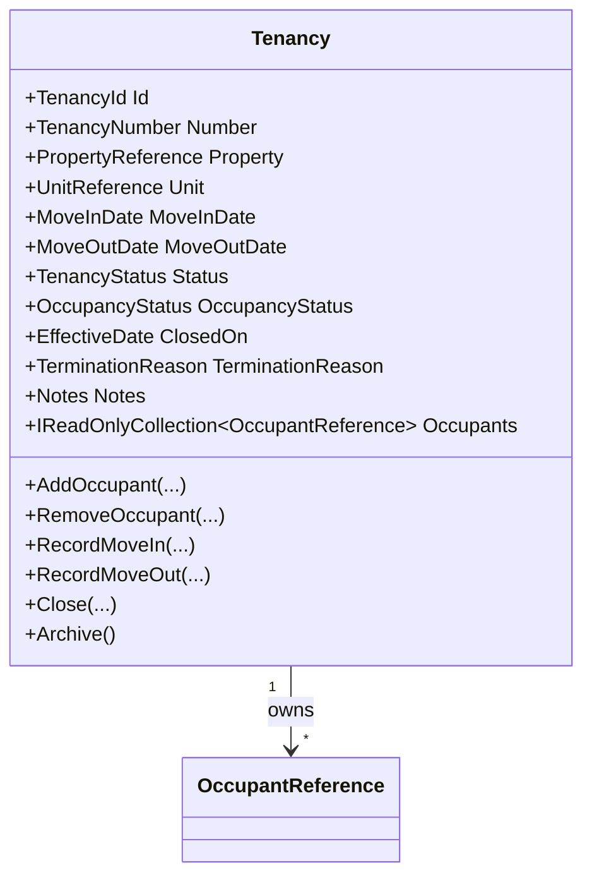

# Tenancy Domain Foundation

- Document ID: ARCH-DOMAIN-003
- Title: Tenancy Domain Foundation
- Version: 1.0
- Status: Active
- Owner: Domain Engineering
- Last Updated: 2026-07-27
- Next Review: [TBD]
- Related ADRs: [docs/adr/ADR-0004_Domain_Boundaries.md](../adr/ADR-0004_Domain_Boundaries.md)
- Related Standards: [docs/standards/ENG-001_Engineering_Standards.md](../standards/ENG-001_Engineering_Standards.md)
- Related Playbooks: [docs/playbooks/MODULE_DEVELOPMENT_GUIDE.md](../playbooks/MODULE_DEVELOPMENT_GUIDE.md)

## Purpose

Establish the Tenancy bounded-context foundation as the ownership model for occupancy lifecycle.

## Scope

This document covers:

- Tenancy aggregate boundary and lifecycle transitions
- Occupant ownership model with mandatory primary occupant
- Move-in and move-out sequencing invariants
- Active-tenancy uniqueness by unit
- Application-layer orchestration and persistence boundaries
- Platform abstraction consumption through tenancy orchestrator

This document does not define leasing economics, billing schedules, maintenance workflows, or authorization policies.

## Aggregate Model

## Domain Invariants

- Tenancy must be created with a primary occupant.
- Multiple occupants are allowed.
- Move-out date must be strictly after move-in date.
- Active tenancy overlap for the same unit is prevented by repository boundary checks.
- Archived tenancy is immutable.
- Future-dated tenancies are valid and begin in Scheduled occupancy state.

## Domain Events

Tenancy aggregate emits:

- TenancyCreatedDomainEvent
- OccupantAddedDomainEvent
- OccupantRemovedDomainEvent
- MoveInRecordedDomainEvent
- MoveOutRecordedDomainEvent
- TenancyClosedDomainEvent

## Cross-Context Boundary

Tenancy consumes People and Property contexts through identity-only references:

- PersonId for occupants
- Guid-based PropertyReference and UnitReference

Tenancy does not import Person or Property aggregate models.

## Application Boundary

Tenancy module application layer follows the established command/query handler pattern:

- Commands, queries, handlers
- Application service orchestration
- Repository contract
- Unit-of-work abstraction
- Platform orchestrator
- Execution results

## Persistence Boundary

Infrastructure adapts the Tenancy aggregate with EF Core mappings.

- Occupants are persisted via owned collection mapping.
- Tenancy value objects are mapped through converters/owned mappings.
- Domain events remain in-memory and are ignored by EF mappings.

## Platform Integration

Tenancy operations consume platform abstractions through an orchestrator:

- Configuration
- Metadata
- Rules
- Workflow
- Event publishing via domain-event publisher
