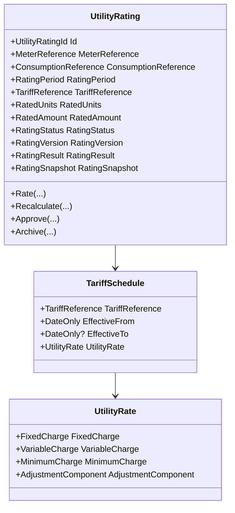

# Utility Rating Engine Foundation

- Document ID: ARCH-DOMAIN-007
- Title: Utility Rating Engine Foundation
- Version: 1.0
- Status: Active
- Owner: Domain Engineering
- Last Updated: 2026-07-27
- Next Review: [TBD]
- Related ADRs: [docs/adr/ADR-0002_Configuration_First.md](../adr/ADR-0002_Configuration_First.md), [docs/adr/ADR-0005_Versioned_Configuration.md](../adr/ADR-0005_Versioned_Configuration.md)
- Related Standards: [docs/standards/ENG-001_Engineering_Standards.md](../standards/ENG-001_Engineering_Standards.md)
- Related Playbooks: [docs/playbooks/MODULE_DEVELOPMENT_GUIDE.md](../playbooks/MODULE_DEVELOPMENT_GUIDE.md)

## Purpose

Establish the Utility Rating bounded context that converts metering consumption outputs into immutable rated consumption records for Billing consumption.

## Scope

This foundation includes:

- UtilityRating aggregate ownership and lifecycle
- Tariff schedule and utility rate model
- Consumption snapshot intake contract boundary
- Versioned re-rating behavior
- Persistence adapter and architecture boundary tests

This foundation excludes bill generation, payments, ledger posting, subsidy optimization, tariff slab intelligence, load balancing, weighted allocation, and reporting.

## Step 1 Findings

Read-only investigation outcomes:

- Ownership: Utility Rating should be a standalone bounded context; Billing consumes rated outputs but does not own tariff math.
- Rating lifecycle: rate initial consumption, approve/archive as governance states, re-rate by issuing a new version.
- Calculation boundaries: deterministic fixed + variable + adjustment with minimum-charge floor, no subsidy logic.
- Configuration dependencies: tariff selection and defaults are configuration-first and versioned per ADR-0005.
- Rules dependencies: rule evaluation is read-only and deterministic through platform rules; no workflow execution inside rating calculations.
- Business-rule and subsidy history: no dedicated `docs/Business` subsidy/tariff notes currently exist; roadmap references Subsidy Maximizer as future work.

## Aggregate Diagram

## Rating Lifecycle

1. `RateConsumption`: create version 1 rated record from metering contract snapshot and tariff schedule.
2. `ApproveRating`: mark calculated rating as approved for downstream billing consumption.
3. `ArchiveRating`: archive superseded or invalidated rating versions.
4. `RecalculateRating`: create a new immutable version from corrected consumption or tariff schedule.

## Versioning Model

- One rating per Meter + RatingPeriod + RatingVersion.
- Initial rating starts at version 1.
- Re-rating never rewrites historical versions; it creates a new record with version +1.
- Historical ratings are retained for auditability.

## Domain Rules

- Negative consumed units are prohibited.
- Rating period must be valid (`start < end`).
- Tariff schedule must cover rating period.
- Rated amounts cannot be negative.
- Archived ratings cannot be approved.

## Domain Events

- ConsumptionRatedDomainEvent
- RatingRecalculatedDomainEvent
- TariffAppliedDomainEvent
- RatingApprovedDomainEvent
- RatingArchivedDomainEvent

## Cross-Context Boundary

- Utility Rating has no direct dependency on Metering, Billing, Payment, or Ledger modules.
- Metering intake is modeled through a published contract DTO in the Utility Rating contracts boundary.

## Persistence Boundary

Utility Rating persistence is implemented in Infrastructure through EF Core mapping:

- `utility_ratings` table
- JSONB columns for reference and snapshot/value-object persistence
- Domain event collection ignored in persistence mapping

## Technical Debt

- Upstream Metering published contracts should be promoted to a dedicated shared contract package to replace local intake DTO ownership.
- Query translation for meter-period-version lookups currently uses in-memory filtering on value-object equality and should be optimized with scalar indexing strategy.

## Recommendation Before Subsidy Engine

Complete tariff governance workflows and contract publication strategy first, then build Subsidy Engine as a separate bounded context consuming rated outputs without changing Utility Rating aggregate ownership.
